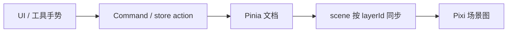
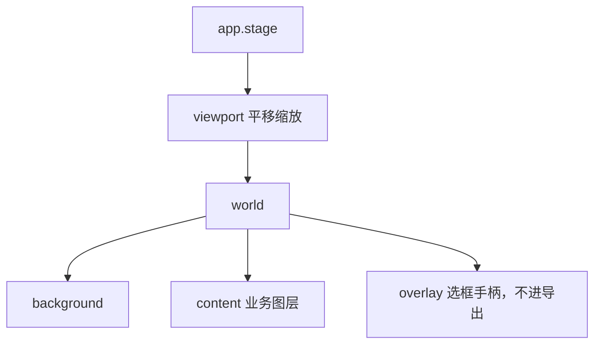

# 分层与数据流

- 模块：architecture
- 代码：`src/editor/`、`src/shared/`、`src/layouts/`、`src/views/editor/`
- 约定全文：[`../process/coding-standards.md`](../process/coding-standards.md)

## 职责

Vue 管壳与交互入口，Pinia 是文档真源，Pixi 只做单向渲染同步。禁止场景成为第二真源。

## 数据流

禁止反向：Pixi 事件处理里直接改文档字段；store 里 `import { Sprite }`。

## 分层

| 层 | 目录 | 只允许 | 禁止 |
|---|---|---|---|
| UI | `src/views/`、`src/layouts/`、`src/editor/components/` | 面板、按钮；调 store / 发命令 | `import 'pixi.js'`；持有 DisplayObject |
| 状态 | `src/editor/store/` | 文档、选中、视口；公开 action | 创建 `Application` |
| 模型 / 命令 | `src/editor/model/`、`src/editor/history/` | 类型、纯校验、Command | 碰 canvas / ticker |
| 工具手势 | `src/editor/tools/` | 指针 → store action / Command | 改场景图或 store 私有字段 |
| 渲染同步 | `src/editor/scene/` | 文档 → 场景 diff | 写业务规则；回写文档 |
| 引擎生命周期 | `src/editor/core/` | `Application` init / destroy / 挂载 | 图层算法、撤销栈 |
| 共享 | `src/shared/` | 无业务语义的纯函数 | 依赖 Pinia 或 Pixi 对象 |

## 场景图（渲染侧）

视口变换只写 `store.viewport`，图层变换只写 `layer.transform`。导出只渲染 `world`，隐藏 `overlay`。

## 后续版本

feat-008 起会在 overlay 画选框；feat-014 把 store action 收成 Command 栈。新模块文档加在本目录，不要把分层表复制进每一篇。
