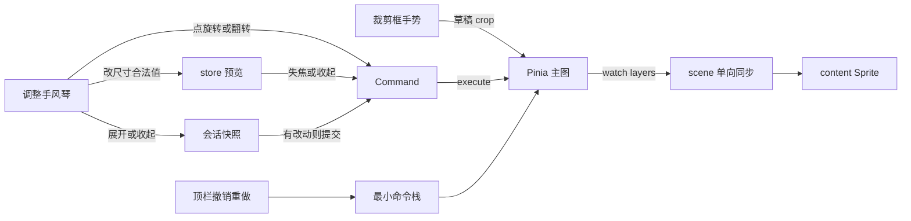

# 调整 Tab：裁剪 / 旋转 / 改尺寸

- 模块：adjust
- feature：feat-010、feat-032（面板旋转随本期交付；**不是** feat-008）
- OpenSpec：`image-adjust`、`editor-shell`（归档：`2026-08-19-add-adjust-tab-phase1`）
- 代码：`src/editor/model/imageAdjust.ts`、`src/editor/model/viewportMath.ts`、`src/editor/history/`、`src/editor/store/editor.ts`、`src/editor/components/adjust/`、`src/editor/scene/syncImageLayers.ts`

## 职责

在【调整】工作区对已导入主图做比例裁剪、90°/自定义角度/翻转、显示尺寸。文档真源仍是 `ImageLayer`（`crop`、`flipX/Y`、正 `scale`、`transform.rotation`）。不提供画布包围盒或自由变换。最小命令栈只覆盖这三项；滤镜 / 图层 / 导入不进本栈。视口平移由顶栏「抓手」提供，本面板无平移按钮。再次导入会清空本命令栈。

## 数据流

不变量：`transform.x/y` 是**当前可见图中心**。提交裁剪时 `rebaseTransformToVisibleCenter`；Sprite `anchor` 对齐该中心。一级模块彼此独立，每次展开都以画布当前可见图为基准。

## 公开契约

- 模型：`listCropRatios`、`clampCropRect`、`resizeCropRectFromHandle`（边中点只改一边）、`normalizeDegrees`、`pxFromUnit` / `unitFromPx`（DPI=96）、`updateDisplaySize`
- 视口：`visibleImageRect`、`visibleImageAnchor`、`rebaseTransformToVisibleCenter`、`imageLayerWorldBounds`（旋转 AABB）、`cropOverlayLayout`
- Store：`beginCropSession` / `previewCrop` / `commitCropSession` / `cancelCropSession`；`rotateMainByDegrees`、`flipMain`；`beginAngleEdit` / `previewAngleDegrees` / `commitAngleEdit`；`beginResizeEdit` / `previewDisplaySize` / `commitResizeEdit`；`undo` / `redo`
- 历史：`EditorCommand` + 线性 `createCommandStack`
- 场景：正 scale；翻转用符号；crop 用 Graphics mask；overlay 不进导出
- 改尺寸展开**不** `fitView`，避免把尺寸变化看没；裁剪 / 旋转提交或展开时适配居中

## 验证

- TDD：`imageAdjust.spec.ts`、`viewportMath` 可见矩形 / AABB / overlay、`commandStack.spec.ts`、store 裁剪 rebase 与 fitView
- 手工（task 8.5 仍待浏览器确认）：手风琴互斥；遮罩不出 host；边中点矩形只改一边；拖动才出井字格；应用后适配；裁后再旋转绕新图中心；无变换手柄；一块 canvas

## 后续版本

feat-008 画布选择与自由变换；feat-014 把导入 / 滤镜 / 图层纳入同一撤销栈；feat-024 椭圆与 alpha 蒙版。
