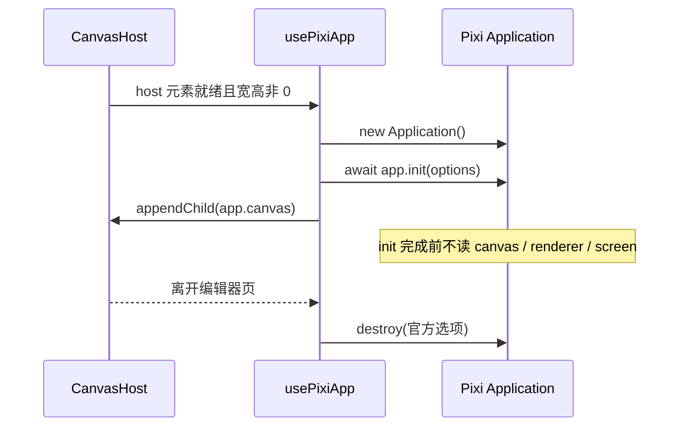

# Pixi Application 生命周期

- 模块：pixi-app
- feature：feat-005
- OpenSpec：`pixi-application`
- 代码：`src/editor/core/usePixiApp.ts`、`src/editor/core/pixiAppOptions.ts`

## 职责

在 host 就绪后 `new Application()` + `await app.init(options)`，挂载 `app.canvas`，离开页按官方选项 `destroy`。不管图层、视口手势或导入。

## 数据流

## 公开契约

- `createPixiAppInitOptions(host)`：`resizeTo: host`、`autoDensity`、`resolution`、`preference: 'webgl'`、深色背景
- 构造函数不传 options；只用 `app.canvas`，不用 `app.view`
- 卸载：`app.destroy({ removeView: true, releaseGlobalResources: true }, { children: true, texture: true, textureSource: true })`
- 重复进入页面不得留下第二块 canvas
- UI / store 禁止 `import 'pixi.js'`

## 验证

- TDD：`createPixiAppInitOptions` 的选项形状与边界
- 手工：进页一块 canvas、深色空舞台；缩放跟 host；离开再进仍一块 canvas

## 后续版本

feat-016 补纹理销毁与反复进出无泄漏的验收清单。host 尺寸变化后的 `app.resize()` 已由视口模块的 ResizeObserver 触发。
