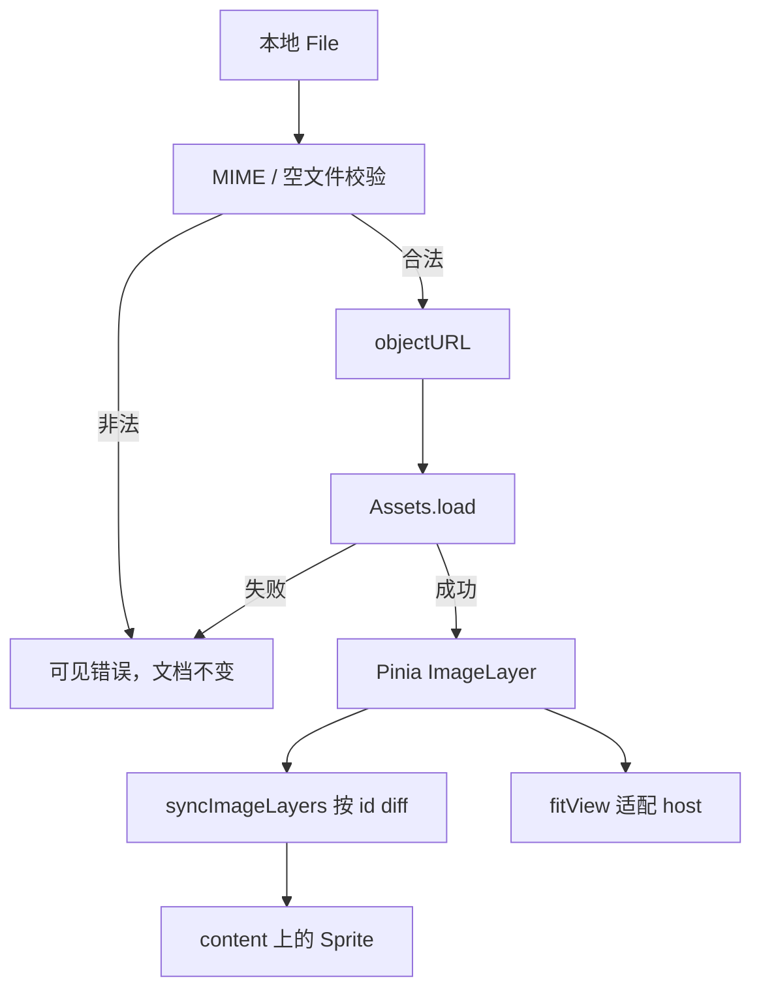

# 场景分层与图片导入

- 模块：scene
- feature：feat-006
- OpenSpec：`scene-import`
- 代码：`src/editor/scene/`、`src/editor/assets/loadLocalImage.ts`、`src/editor/model/imageFile.ts`、`src/editor/model/imageLayer.ts`

## 职责

搭建 viewport / world / content 分层；本地 JPEG/PNG/WebP 经 `Assets.load` 成为文档中的主图 Sprite。主图仅一张，再次导入替换。不把视口写进图层 `transform`。

## 数据流

## 公开契约

- `createSceneGraph`：只搭空容器，不读 store
- `loadLocalImage`：File → objectURL → `Assets.load`；失败要提示并 `revoke`
- 文档主图一张；`addImageLayer` 替换旧层
- `syncImageLayers`：按 layerId 增删改 Sprite，禁止每帧拆建整棵树
- 导入成功后 `fitView`（与顶栏适配同一套数学）
- UI 不 `import 'pixi.js'`

## 验证

- TDD：文件校验、图层模型、store 替换主图
- 手工：Open / 拖入 / 空态点击；居中适配；坏文件报错；hint 隐藏；进出页一块 canvas

## 后续版本

feat-009 多图层排序；feat-016 `revokeObjectURL` 与纹理销毁收口。当前 objectURL 先记在图层上。
