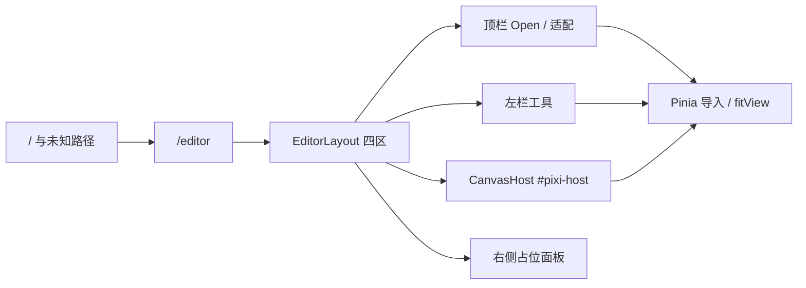

# 路由与应用壳

- 模块：shell
- feature：feat-003、feat-004
- OpenSpec：`editor-router`、`editor-shell`
- 代码：`src/router/`、`src/layouts/EditorLayout.vue`、`src/views/editor/`、`src/editor/components/`、`src/editor/canvas/`

## 职责

提供可刷新的 `/editor` 入口和四区布局；中央 `#pixi-host` 必须有稳定宽高，供 `usePixiApp` 挂载。不创建渲染器，不持有 DisplayObject。

## 数据流

## 公开契约

- 路由：`/` 与 catch-all 重定向 `/editor`；`App.vue` 只留 `<RouterView />`
- 布局：顶栏、左工具、中央 host、右侧面板同时可见
- `canvasHostContract`：host 必须可测宽高；空文档显示「拖入或点击打开」；有主图后隐藏 hint
- 顶栏 Open / 空 host 点击 / 拖入走导入；适配走 `fitView`；平移工具走视口。撤销、导出等仍可占位

## 验证

- TDD：host 契约、布局相关纯逻辑
- 手工：刷新 `/` 与 `/editor` 进编辑器；四区可见；窗口缩放 host 仍在中央且有面积

## 后续版本

feat-008 启用选择工具；feat-009 右侧改为真实图层面板。
