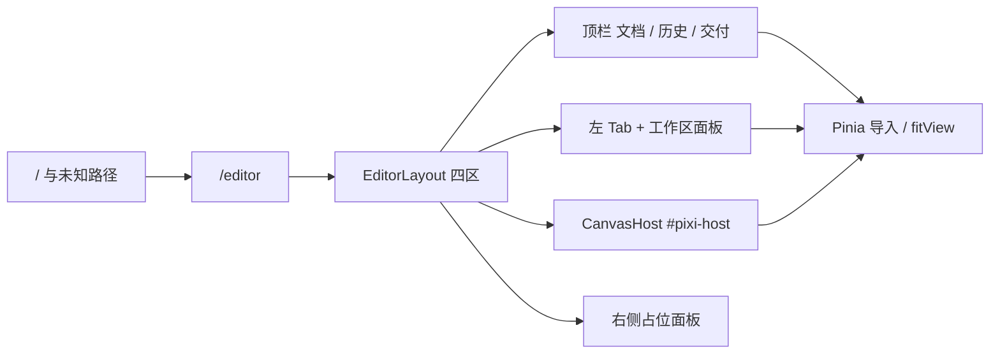

# 路由与应用壳

- 模块：shell / chrome
- feature：feat-003、feat-004、feat-031、feat-036
- OpenSpec：`editor-router`、`editor-shell`（归档：`2026-08-18-add-left-workspace-tabs`）
- 代码：`src/router/`、`src/layouts/EditorLayout.vue`、`src/views/editor/`、`src/editor/components/`、`src/editor/canvas/`、`src/editor/model/workspaceTabs.ts`、`src/editor/model/chromeTheme.ts`

## 职责

提供可刷新的 `/editor` 入口和四区布局；中央 `#pixi-host` 必须有稳定宽高，供 `usePixiApp` 挂载。不创建渲染器，不持有 DisplayObject。左侧工作区 Tab 选中与壳层色板是 UI / model 常量，不进 Pinia 文档。

## 数据流

## 公开契约

- 路由：`/` 与 catch-all 重定向 `/editor`；`App.vue` 只留 `<RouterView />`
- 布局：顶栏、左侧工作区（六 Tab + 面板）、中央 host、右侧面板同时可见
- 顶栏三分区：左品牌 + 打开（已接线）；中历史 / 撤销 / 重做（占位）；右适配（已接线）+ 保存（主按钮占位）
- 浅色壳：顶栏白、Tab 列浅灰、host 与 Pixi `background` 为 `#ebebeb`；选中 Tab 与保存共用强调色 `#ff4d6d`
- `canvasHostContract`：host 必须可测宽高；空文档显示「拖入或点击打开」；有主图后隐藏 hint
- 切 Tab、改肤色不得卸载 `#pixi-host`
- 顶栏 Open / 空 host 点击 / 拖入走导入；适配走 `fitView`；平移在调整面板。撤销、保存等仍可占位

## 验证

- TDD：host 契约、`workspaceTabs`、`chromeTheme`、Pixi init 背景跟 host
- 手工：刷新 `/` 与 `/editor` 进编辑器；四区可见；浅色壳；顶栏三分区；切 Tab 仍一块 canvas；窗口缩放 host 仍有面积

## 后续版本

feat-008 启用选择工具；feat-009 右侧改为真实图层面板；feat-014 / 015 接线撤销与保存。
