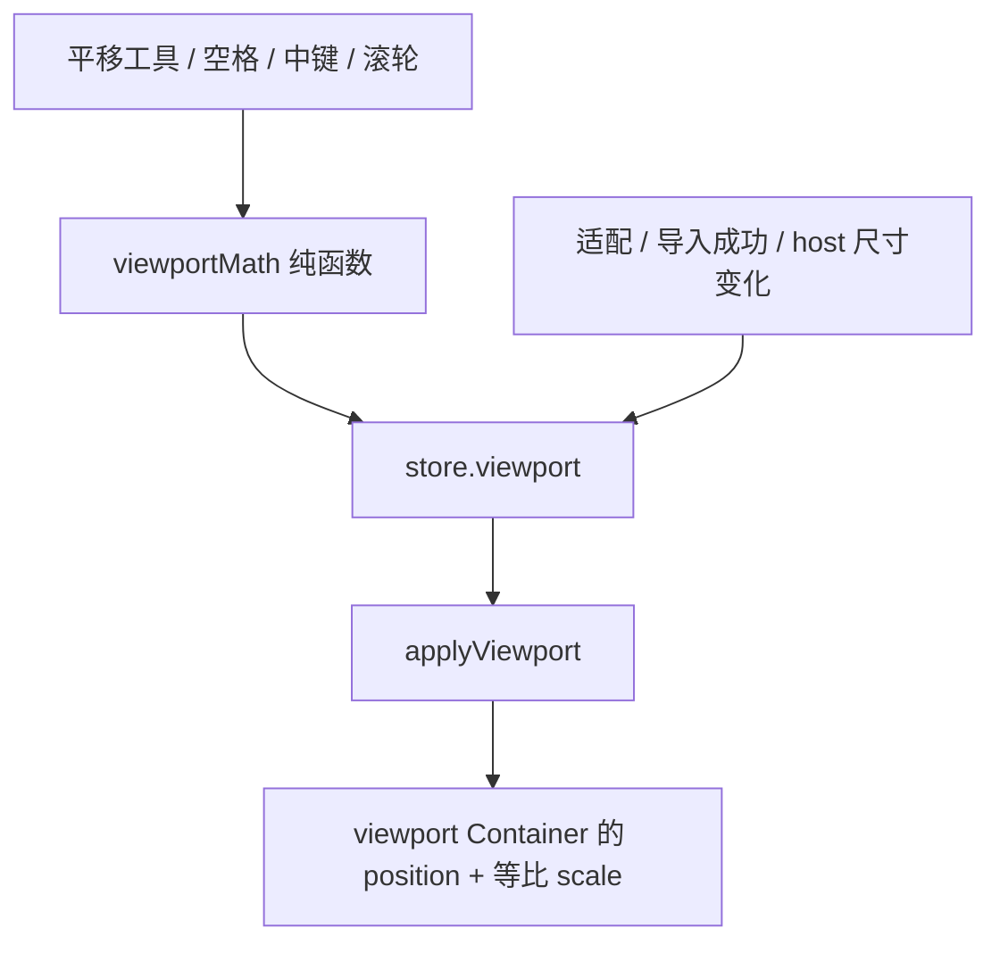
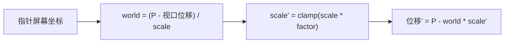

# 视口平移与缩放

- 模块：viewport
- feature：feat-007
- OpenSpec：`viewport-navigation`
- 代码：`src/editor/model/viewportMath.ts`、`src/editor/store/editor.ts`、`src/editor/tools/useViewportGestures.ts`、`src/editor/scene/applyViewport.ts`

## 职责

把 `{ x, y, scale }` 存在 Pinia，同步到 viewport Container。平移 / 滚轮缩放 / 适配只改视口，不改图层 `transform`。左键拖拽在平移工具、空格或中键时才平移，把左键留给 feat-008 选择。

## 数据流

指针锚点缩放（屏幕空间，viewport 在 stage 下）：

## 公开契约

- `clampViewportScale`：正有限，夹在 `[0.1, 8]`
- `panBy` / `zoomAt` / `fitView`：只改 viewport；无主图时 Fit 回到单位变换
- 滚轮在 host 上 `preventDefault`，避免页面滚动
- host `ResizeObserver`：布局稳定后 `app.resize()`，尺寸真变且有主图才重新 Fit
- UI / store 不持有 DisplayObject

## 验证

- TDD：`viewportMath` 与 store 的 pan / zoom / fit
- 手工：平移工具 / 空格 / 中键；滚轮锚点缩放且页面不滚；适配；导入后自动适配；拖窗口后画布与主图跟上

## 后续版本

feat-008 选择工具占用左键；feat-018 `Ctrl+0` 适配快捷键。
