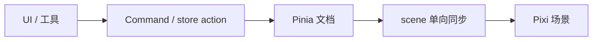

# OpenSpec（本仓库 SDD）

产品方案在 [`../product/`](../product/)。编码约定见 [`coding-standards.md`](./coding-standards.md)。已落地模块见 [`../editor/`](../editor/)。OpenSpec 只记录**已归档的行为**和**当前变更的 delta**，不要把整份计划一次性抄进 `openspec/specs/`。

默认 schema 是仓库内的 **`spec-driven-zh`**（fork 自 spec-driven）：产物仍是 proposal / specs / design / tasks，但 **`design.md` 必须用中文，并含 mermaid 流程图**。

## 文档与产物

```
docs/
  process/     工程约定（本文）
  product/     产品背景
  editor/      按模块的设计说明（随版本增长）
  tooling/     Codegraph / Pixi MCP
openspec/
  config.yaml
  schemas/spec-driven-zh/   # 中文 design 模板
  specs/                    # 主 spec（归档后才增长）
  changes/
    <change>/
      proposal.md
      design.md             # 中文 + mermaid
      tasks.md
      specs/<capability>/spec.md
    archive/
```

## 一条工作流

Cursor 聊天（重启 IDE 后可用）：

1. `/opsx-explore` — 可选，先摸清现状
2. `/opsx-propose <feat-00x 一句话>` — 只写规划产物，不写业务代码
3. 人审 proposal / specs / design / tasks
4. `/opsx-apply` — 按 tasks 实现；纯逻辑先红后绿
5. `./init.sh` 通过后 `/opsx-archive`
6. 归档后补或更新 `docs/editor/<模块>.md`（可从 `_template.md` 复制）

CLI（请用 npx，本机全局 CLI 可能偏旧）：

```bash
npx -y @fission-ai/openspec@latest list
npx -y @fission-ai/openspec@latest status --change <name>
npx -y @fission-ai/openspec@latest validate --all --strict
```

## design.md（强制）

每次 change **都必须**写 `design.md`，不得跳过。

| 要求 | 说明 |
|---|---|
| 中文 | 整份用中文写思路；标识符、路径、类型名可保留英文 |
| 流程图 | 至少一张 mermaid（`flowchart` 或 `sequenceDiagram`），说明数据流或手势/生命周期 |
| 分层 | 点名本变更落在哪一层、邻居用哪份公开契约 |
| 真源 | Pinia 文档是唯一业务真源；禁止第二真源 |
| 验证 | 纯逻辑 TDD vs 画布手工清单，写在「验证策略」 |

章节与模板见 `openspec/schemas/spec-driven-zh/templates/design.md`。生成时 `openspec instructions design` 会注入该模板与中文规则。

示例（数据流，可按变更改节点）：



## 与 Harness 的对应

| 产物 | 职责 |
|---|---|
| OpenSpec change | 这一刀要改变的行为（Why / What / 场景） |
| `feature_list.json` | 执行队列与 done 证据 |
| `docs/product/` | 产品背景，不是主 spec |
| `docs/editor/` | 已落地模块的设计说明，随版本迭代 |

规则：**一次 change = 一项 feature**。实现前必须有完整规划产物。
