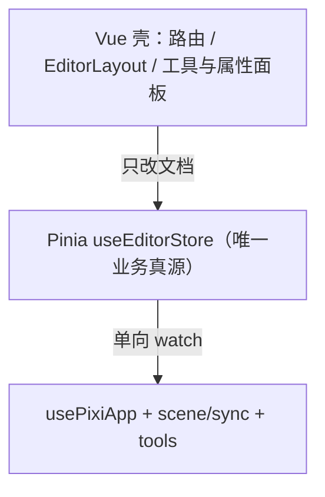
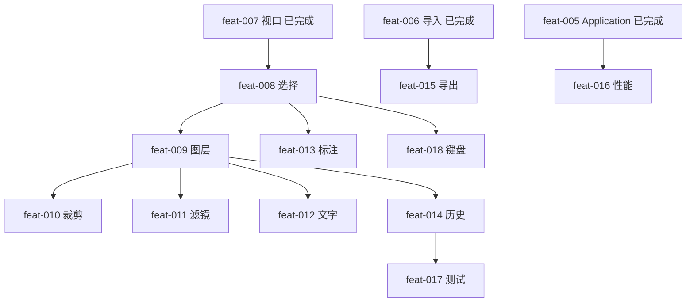

# PixiJS 图片画布编辑器开发计划

产品执行计划（原 `editor-plan.md` + `editor-scheme.md` 合并）。  
执行进度以仓库根目录 `feature_list.json` 为准；已落地模块见 [`../editor/`](../editor/)。  
模块设计、调研与 3～6 个月路线见 [`handbook/`](./handbook/)。不要把本文整份灌进 `openspec/specs/`。

| 项 | 值 |
|---|---|
| 产品 | 浏览器内本地图片画布编辑器 |
| 壳层 | Vue 3 + TypeScript + Vite + Pinia + Ant Design Vue + vue-router |
| 渲染 | PixiJS v8（`pnpm add pixi.js`，禁止 `create-pixi` 覆盖仓库） |
| MVP 工期 | 约 24 人日（单人连续，不含联调；003–007 已消耗） |
| 当前基线 | feat-003～007 已归档：`/editor`、四区壳、Application、主图导入、视口平移缩放 |
| 下一刀 | **feat-008** 选择与变换 |

一次只做 `feature_list.json` 中一项，完成后跑 `./init.sh`，再 `/opsx-archive`。归档后补 [`../editor/<模块>.md`](../editor/)。

---

## 1. 目标与范围

### 1.1 要交付的用户路径

1. 打开站点即进入 `/editor`
2. 拖入或选择本地 JPEG/PNG/WebP，画布居中显示并适配 host
3. 平移 / 滚轮缩放浏览大图；顶栏「适配」
4. 选中图层，移动、等比缩放、旋转
5. 管理图层显隐、排序、锁定
6. 裁剪、调色、加文字、加标注
7. 撤销 / 重做
8. 导出 PNG 或 JPEG（不含选框 overlay）

### 1.2 非目标

多人协作、云素材、AI 修图、视频时间轴、移动端原生壳、GIF 时间轴。需要时在 handbook 里按【后续演进】单独立项。

### 1.3 硬约束（PixiJS v8）

```ts
const app = new Application()
await app.init({
  resizeTo: hostEl,
  background: '#1a1a1a',
  antialias: true,
  autoDensity: true,
  resolution: window.devicePixelRatio,
  preference: 'webgl',
})
hostEl.appendChild(app.canvas)
```

禁止：

- 向 `new Application(options)` 传参
- 使用已弃用的 `app.view`（用 `app.canvas`）
- 在 `init()` resolve 前访问 `canvas` / `renderer` / `screen`
- 卸载时只删 DOM、不走官方  
  `app.destroy({ removeView: true, releaseGlobalResources: true }, { children: true, texture: true, textureSource: true })`

交互：`eventMode = 'static'` + `globalpointermove`。资源：`Assets.load`，不要手写 `Image` + `Texture.from` 作为主路径。  
API 查 Context7 `/pixijs/pixijs/v8.16.0`，见 [`../tooling/pixijs-mcp.md`](../tooling/pixijs-mcp.md)。

---

## 2. 架构



原则：场景不是真源。工具写 store action / Command → Pinia 改文档 → sync 更新 Pixi。导出只渲染 `world`，不渲染 `overlay`。UI / store **禁止** `import 'pixi.js'`。

分层与数据流细则见 [`../editor/architecture.md`](../editor/architecture.md)。不要引入与 Pinia 平行的第二文档真源。

### 2.1 场景图

```
app.stage
  └─ viewport          平移、缩放（视口，不是图层）
       └─ world
            ├─ background   棋盘/底色
            ├─ content      按 zIndex 排的业务图层
            └─ overlay      选框、手柄；导出排除
```

视口只写 `store.viewport`；图层只写 `layer.transform`。

### 2.2 目录

```
src/
  router/index.ts
  layouts/EditorLayout.vue
  views/editor/EditorPage.vue
  editor/
    core/usePixiApp.ts
    scene/{createSceneGraph,syncImageLayers,applyViewport,useEditorScene}.ts
    model/{types.ts,viewportMath.ts,imageLayer.ts,imageFile.ts}
    store/editor.ts
    tools/useViewportGestures.ts
    assets/loadLocalImage.ts
    canvas/canvasHostContract.ts
    components/{EditorToolbar,EditorToolRail,CanvasHost,EditorSidePanel}.vue
    history/stack.ts          # feat-014
    export/extract.ts         # feat-015
    tools/{select,transform,crop,annotate,text}.ts
```

---

## 3. 数据模型

先定类型再写工具。与 `src/editor/model/types.ts` 对齐处：视口字段是 **`scale`**（不是 zoom）。未落地的 `crop` / `filters` / `TextLayer` / `ShapeLayer` 按 feat 增量加进联合类型，不要另起 Object 体系。

```ts
type LayerId = string
type LayerKind = 'image' | 'text' | 'shape'

interface Transform2D {
  x: number
  y: number
  scaleX: number
  scaleY: number
  rotation: number // 弧度
}

interface ColorAdjust {
  brightness: number
  contrast: number
  saturation: number
  hue: number
}

interface BaseLayer {
  id: LayerId
  name: string
  kind: LayerKind
  visible: boolean
  locked: boolean
  transform: Transform2D
}

interface ImageLayer extends BaseLayer {
  kind: 'image'
  objectUrl: string
  naturalWidth: number
  naturalHeight: number
  crop?: { x: number; y: number; width: number; height: number }
  filters?: ColorAdjust
}

interface TextLayer extends BaseLayer {
  kind: 'text'
  text: string
  fontSize: number
  fill: string
}

interface ShapeLayer extends BaseLayer {
  kind: 'shape'
  shape: 'rect' | 'ellipse' | 'arrow' | 'path'
  stroke: string
  fill?: string
  points?: { x: number; y: number }[]
}

interface ViewportState {
  x: number
  y: number
  scale: number
}

interface EditorDocument {
  layers: BaseLayer[] // 底 → 顶；末尾 = 最顶层
  selectedIds: LayerId[]
  viewport: ViewportState
}

interface Command {
  readonly name: string
  execute(): void
  undo(): void
}
```

`objectUrl` 仅运行时有效，不持久化。当前实现主图仅一张，feat-009 起变为多层。

---

## 4. 界面

```
┌──────── 顶栏：打开 / 撤销重做 / 适配 / 导出 ────────┐
│ 工具 │                 画布 host                  │ 图层 │
│ 选择 │              #pixi-host                    │ 列表 │
│ 平移 │                                            │─────│
│ 裁剪 │                                            │ 属性 │
│ 文字 │                                            │ 变换 │
│ 形状 │                                            │ 滤镜 │
└──────────────────────────────────────────────────┘
```

- 空文档：host 显示「拖入图片或点击打开」
- 画布区必须是稳定 DOM，`usePixiApp` 的 `resizeTo` 指向它
- 面板用 Ant Design Vue；画布交互全部在 Pixi
- 快捷键：空格暂切平移（已有）；Ctrl+Z / Y、Delete、方向键、Ctrl+0 随 feat-014/018

---

## 5. 阶段方案

与 handbook Phase A–E 对应。人日为单人估算。状态以 `feature_list.json` 为准。

### 总表

| Phase | 手册 | ID | 内容 | 状态 | 人日 | 验收 | Skill |
|---|---|---|---|---|---|---|---|
| P0 底座 | 已完成 | feat-003 | 注册 vue-router，默认 `/editor` | done | 0.5 | 刷新 `/` 与 `/editor` 进编辑器 | — |
| | | feat-004 | EditorLayout 四区 + `#pixi-host` | done | 1 | 四区可见，host 有面积并随窗口变 | — |
| | | feat-005 | `usePixiApp` init / 挂载 / destroy | done | 1 | 一块 canvas；离页再进仍一块 | pixijs-create, pixijs-application |
| P1 能看 | 已完成 | feat-006 | 场景分层 + 本地导入 | done | 1.5 | JPEG/PNG/WebP 居中；坏文件提示 | pixijs-assets, sprite, container |
| P2 可逛 | 已完成 | feat-007 | 视口平移、滚轮、适配 | done | 1.5 | 大图可逛；resize 不糊 | pixijs-math |
| P2 可改 | **A** | feat-008 | 选择、移动、缩放、旋转 | not-started | 2.5 | 手柄拖拽；锁定不可变；点空白取消 | pixijs-events, math, graphics |
| P3 图层 | **A** | feat-009 | 图层面板与场景同步 | not-started | 2 | 显隐/排序/锁定与画布一致 | pixijs-scene-container |
| | **B** | feat-010 | 矩形裁剪 / 蒙版 | not-started | 2 | 非破坏 crop；结果可再变换 | masking |
| P4 编辑 | **D** | feat-011 | 亮度/对比度/饱和度/色相 | not-started | 1.5 | 滑条预览，可重置 | pixijs-filters, color |
| | **C** | feat-012 | 文字图层 | not-started | 1.5 | 添加、字号颜色、可变换 | pixijs-scene-text |
| | **C** | feat-013 | 矩形/椭圆/箭头/画笔 | not-started | 2 | 矢量可再选中 | pixijs-scene-graphics |
| P5 闭环 | **B** | feat-014 | 命令式撤销重做 | not-started | 2 | Ctrl+Z/Y 覆盖变换与滤镜 | — |
| | **B** | feat-015 | 导出 PNG/JPEG | not-started | 1 | 无选框；分辨率按 world | extract |
| P6 质量 | **E** | feat-016 | 纹理销毁、culling、无泄漏 | not-started | 1.5 | 反复进出无涨内存 | pixijs-performance |
| | **E** | feat-017 | 模型/命令/导出纯函数测试 | not-started | 1.5 | `pnpm test:run` | — |
| | **E** | feat-018 | 键盘与无障碍 | not-started | 1 | Tab/方向键；accessibleTitle | pixijs-accessibility |

### 5.1 已完成（做法摘要）

**feat-003** `src/router/index.ts`；`main.ts` `app.use(router)`；`/` 与未知路径重定向 `/editor`。  
**feat-004** 四区布局；`CanvasHost` 给出稳定 host。  
**feat-005** `new Application` + `await init({ resizeTo: host, autoDensity, … })`；挂 `app.canvas`；`onUnmounted` 官方 destroy。  
**feat-006** viewport/world/content；`loadLocalImage`：File → objectURL → `Assets.load`；主图一张，再导入替换；成功后 `fitView`。objectURL 先记在图层上，feat-016 收口 revoke 与 History 时机。  
**feat-007** Pinia `viewport`；平移工具 / 空格 / 中键；滚轮指针锚点缩放；适配与 host ResizeObserver。视口不要写进图层 `transform`。

### 5.2 下一刀起（做法）

**feat-008 · 选择与变换**  
点选 hitTest；overlay 画框与 8 向手柄 + 旋转点；`globalpointermove` + `toLocal`/`toGlobal`；改文档 `transform`。左键拖视口仍只在平移工具 / 空格 / 中键。风险：视口缩放后手柄必须在 world 空间算。任务号见 handbook `SEL-*`。

**feat-009 · 图层面板**  
右侧列表 = `layers` 倒序；显隐/锁定/重命名/拖拽排序；sync 按 id 增删改，禁止每帧拆建 Sprite。

**feat-010 · 裁剪**  
overlay 拉矩形，写入 `ImageLayer.crop`；mask 裁切；不破坏原 objectURL。可撤销依赖 feat-014 形态，本项先能改文档。

**feat-011 · 调色**  
`ColorMatrixFilter` 绑 `filters`；滑条防抖写入文档；重置回 0。

**feat-012 · 文字**  
点画布建 `TextLayer`；属性改 `text`/`fontSize`/`fill`；走同一套变换。

**feat-013 · 标注**  
矩形/椭圆/箭头/画笔 → `ShapeLayer`；画笔为 `points`；完成后可再选中。

**feat-014 · 历史**  
`history/stack.ts`；变换、图层、滤镜、文字、裁剪均为 Command；Ctrl+Z/Y；连续拖拽合并为一条。

**feat-015 · 导出**  
`overlay.visible = false` → extract `world` → 恢复 overlay → 下载 png/jpeg。分辨率按 world 边界，不被视口裁切。

**feat-016～018**  
删层销毁 texture、revoke、culling、进出无泄漏；Vitest 补命令/裁剪/导出纯函数；方向键微调、Delete、Tab、`accessibleTitle`。

---

## 6. 关键路径

```
003 → 004 → 005 → 006 → 007 → 008 → 009
                                      ├─ 010 裁剪
                                      ├─ 011 调色
                                      ├─ 012 文字
                                      ├─ 013 标注（也可在 008 后提前，但不建议）
                                      └─ 014 历史 → 017 测试
006 也可先做 015 导出草图，正式验收仍建议 009 之后
005 之后即可并行准备 016 的销毁清单，验收放最后
```



禁止同一会话改两项。008 未完成不要开 010/011。

---

## 7. 验证

| 门禁 | 命令 / 行为 |
|---|---|
| 工程 | `./init.sh`（install / lint / test:run / build / openspec / codegraph） |
| 类型 | `pnpm run build` 含 `vue-tsc` |
| 画布 | 进页有 canvas；离开后再进只有一块 |
| 规范 | 构造函数无 options；只用 `app.canvas`；资源走 `Assets` |
| 导出 | 文件能打开，无选框手柄 |
| 测试 | 纯逻辑 `pnpm test:run`；画布手工清单写在 change 的 design.md |

---

## 8. 风险

| 风险 | 阶段 | 处理 |
|---|---|---|
| 视口与图层坐标缠在一起 | P2 | 视口只改 viewport；图层只改 transform；命中用 toLocal |
| 每帧重建 Sprite | P3 | sync 按 layerId diff |
| 卸载泄漏 GPU | P0/P6 | 官方 destroy + 释放纹理与 objectURL；revoke 与 History 时机见 handbook |
| 滤镜实时卡顿 | P4 | 拖动预览、松手写文档；大图降预览分辨率 |
| 导出含 overlay | P5 | extract 前 `overlay.visible = false` |
| 误用 v7 API | 全程 | skill + Context7 v8.16.0，禁止 beginFill / app.view |
| 无测试导致回归 | P6 | 命令与纯函数先单测，画布交互手工清单 |

---

## 9. 里程碑

| 里程碑 | 包含 | 可演示 | 状态 |
|---|---|---|---|
| M0 壳 | 003–005 | 空白 WebGL 画布嵌在布局里 | 已达成 |
| M1 能看 | 006 | 打开一张本地图 | 已达成 |
| M2 能改 | 007–009 | 浏览、变换、图层列表 | 007 已达成；008–009 未做 |
| M3 能编 | 010–013 | 裁剪、调色、文字、标注 | 未做 |
| M4 能交 | 014–015 | 撤销 + 导出文件 | 未做 |
| M5 能养 | 016–018 | 无泄漏、有测试、键盘可用 | 未做 |

M1 即可内部试用；对外以 M4 为准。

---

## 10. Agent 执行约定

1. 读 `AGENTS.md`、本文、`feature_list.json`；模块细节读 `handbook/` 对应章
2. 只领一项 `not-started`，按依赖顺序；先 `/opsx-propose`
3. Pixi 代码先读本机 `~/.agents/skills/pixijs/SKILL.md`，API 查 Context7 `/pixijs/pixijs/v8.16.0`
4. `design.md` 用中文并含 mermaid；纯逻辑先红后绿
5. 完成后写 evidence，跑 `./init.sh`，更新 `progress.md`，归档后补 `docs/editor/`
6. 不把 skill 装回仓库 `.agents/`
