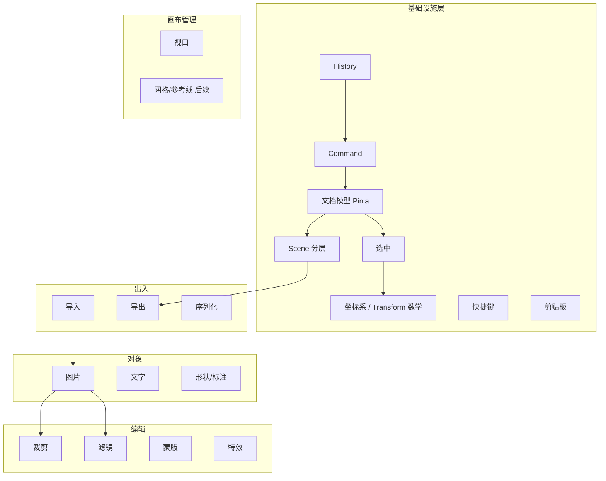
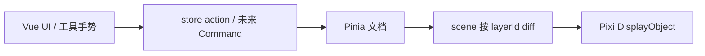
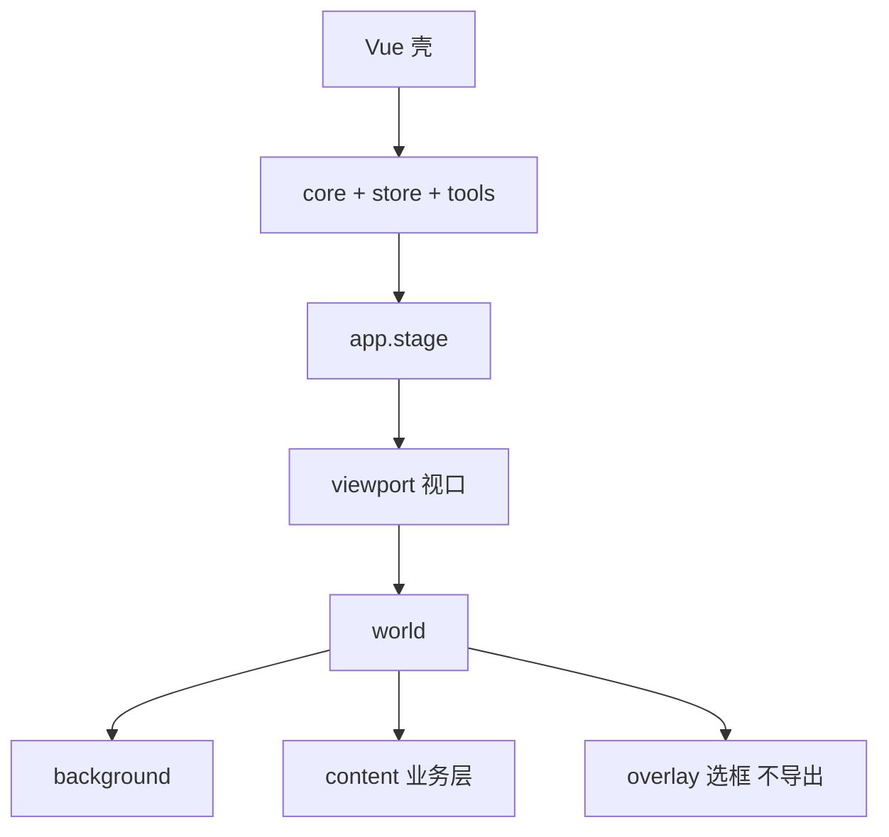
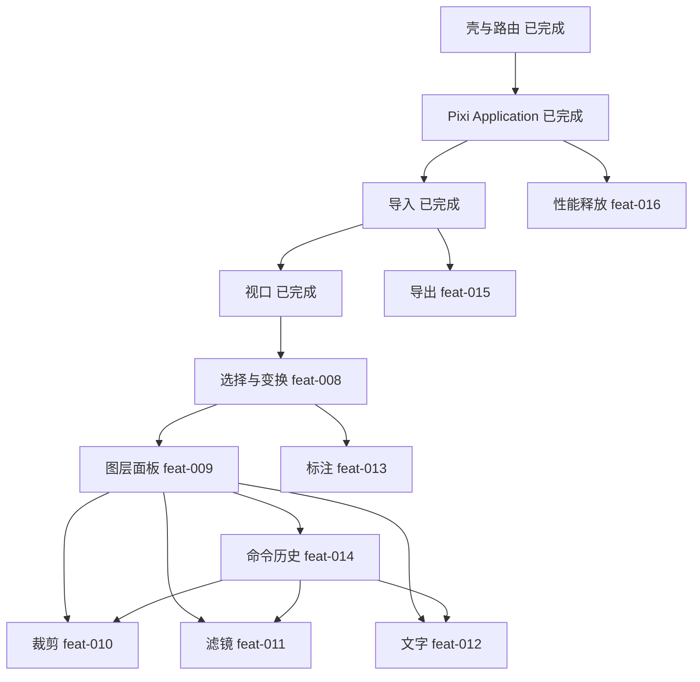

# 04–07 通用功能架构 · 技术架构 · Engine · Object Model

结合**当前仓库已落地代码**。禁止引入与 Pinia 平行的第二文档真源。

## 04 通用功能架构

抽象自调研，不复制某一产品。



| 层 | 本仓库目录 | 状态 |
|---|---|---|
| 基础设施 | `store/` `model/` `core/` `scene/` | 部分落地；选中/命令未做 |
| 画布管理 | `viewport` in store + `applyViewport` | 【保持】feat-007 |
| 导入 | `assets/loadLocalImage.ts` | 【保持】feat-006；主图一张 |
| 图片对象 | `ImageLayer` | 【保持】；多图 【建议新增】feat-009 |
| 选区/Transform | — | 【建议新增】feat-008 |
| 其余编辑/IO | — | 见 04/05 模块章 |

---

## 05 编辑器技术架构

### 5.1 分层（【保持现有架构】）



| 层 | 只允许 | 禁止 |
|---|---|---|
| UI | 面板、按钮；调 store | `import 'pixi.js'`；持有 Sprite |
| Pinia | 图层、选中、视口、工具 | `Application` / DisplayObject |
| model | 类型、纯函数、校验 | ticker / canvas |
| tools | 指针 → action | 改场景或 store 私有字段 |
| scene | 文档 → 场景 | 成为真源；写业务规则 |
| core | init / destroy / 挂载 | 图层算法、历史栈 |

数据流禁止反向：Pixi 回调里直接改 `layers` 字段；store 里 `import { Sprite }`。

### 5.2 Pixi 应负责什么

- `Application` 生命周期与 `app.canvas` 挂载
- 场景图：viewport / world / content / overlay
- Texture / Sprite / Graphics / Text / Filter / Mask 的**呈现**
- 指针命中（`eventMode`）把事件交给 tools，不改文档

### 5.3 Vue / Pinia 应负责什么

- 壳、路由、Ant Design 面板
- **文档真源**：`layers`、`viewport`、未来 `selectedIds`、`history`
- 用户可见错误（导入失败）

### 5.4 哪些能力独立成 Engine

提示词中的 `class EditorEngine` **不要**做成持有 Scene+文档的上帝对象。

【保持现有架构】文档在 Pinia，渲染在 scene，生命周期在 `usePixiApp`。

【建议新增】若需要门面，只做**薄编排**（见 06），内部仍调 store action 与纯函数。

### 5.5 如何避免架构失控

1. 新功能先改 `model/types.ts` 与 OpenSpec，再写 tools/UI。
2. 禁止在 `usePixiApp` / `sync*` 里加业务 if-else 清单。
3. 新对象类型 = 新 `LayerKind` + 新 sync 分支，而不是第二套 store。
4. 插件化边界：tools 与滤镜预设可插拔；坐标、历史、sync 内核不可被插件替换。
5. 一项 `feature_list.json` = 一次 change。

### 5.6 渲染分层



【保持现有架构】导出只抽 `world`（或 content+background），`overlay.visible = false`。

---

## 06 Editor Engine 架构

### 6.1 职责边界

| 组件 | 现状 | 决策 |
|---|---|---|
| `usePixiApp` | init/destroy | 【保持】不要扩成 Engine |
| `useEditorStore` | 图层+视口 | 【保持】真源 |
| `createSceneGraph` / sync | 场景 | 【保持】 |
| `EditorEngine` 类 | 不存在 | 【后续演进】可选门面，**不是**真源 |

### 6.2 若未来加门面（非 P0）

```ts
/** 薄门面：不持有 DisplayObject，不复制一份 layers。 */
export interface EditorEngine {
  readonly getDocument: () => {
    layers: readonly EditorLayer[]
    viewport: ViewportState
    selectedIds: LayerId[]
  }
  dispatch(command: Command): void
  undo(): void
  redo(): void
}
```

实现里只调 Pinia 与 `history/stack`。Pixi 仍由 scene watch 文档。

**拒绝：** Engine 内 `Map<LayerId, Sprite>` 当真源；在 Engine 里 `new Application()`。

### 6.3 状态放哪

| 状态 | 位置 |
|---|---|
| layers / transform / crop / filters / text | Pinia |
| selectedIds / activeTool / viewport | Pinia |
| 拖拽中的临时矩阵 | tools 闭包；pointerup 再提交 |
| Sprite / Texture / Application | scene / core，不进 store |
| 面板展开、theme | Vue 组件或无关的 UI store |

---

## 07 Scene / Object Model

### 7.1 现有模型（【保持】并扩展，不推翻）

当前 `src/editor/model/types.ts`：`BaseLayer` + `ImageLayer`；`EditorLayer = ImageLayer`；`EditorToolId = 'pan'`。

【建议优化】按 kind 扩展联合类型，**不要**新起 `EditorObject` 平行体系。本仓库的 Object = Layer。

```ts
type LayerId = string
type LayerKind = 'image' | 'text' | 'shape' | 'group' // group 为 P2

interface Transform2D {
  x: number
  y: number
  scaleX: number
  scaleY: number
  rotation: number // 弧度
}

interface BaseLayer {
  id: LayerId
  name: string
  kind: LayerKind
  visible: boolean
  locked: boolean
  transform: Transform2D
  opacity?: number // 【建议新增】默认 1
}

interface ImageLayer extends BaseLayer {
  kind: 'image'
  objectUrl: string // 运行时，不序列化
  naturalWidth: number
  naturalHeight: number
  crop?: CropRect
  filters?: ColorAdjust
}

interface TextLayer extends BaseLayer {
  kind: 'text'
  text: string
  fontSize: number
  fill: string
}

interface ShapeLayer extends BaseLayer {
  kind: 'shape'
  shape: 'rect' | 'ellipse' | 'arrow' | 'path'
  stroke: string
  fill?: string
  points?: { x: number; y: number }[]
}

type EditorLayer = ImageLayer | TextLayer | ShapeLayer | GroupLayer
```

映射：

```text
EditorLayer.id  ──sync──►  DisplayObject（Sprite | Text | Graphics）
Pinia.viewport  ──apply──►  viewport Container.position / scale
```

禁止把 DisplayObject 塞进 Pinia。

### 7.2 序列化

| 字段 | 保存 JSON | 剪贴板 | Undo |
|---|---|---|---|
| transform / kind / 样式 | 是 | 是 | 是 |
| objectUrl / Texture | 否 | 否（重 encode 或保留 blob 引用） | 否（按 id 恢复引用） |
| viewport | 可选 | 否 | 否（视口一般不进历史，P2 可配置） |

【后续演进】多页 = `pages: EditorDocument[]`，仍是一层文档，不新开引擎。

### 7.3 功能依赖 DAG



基础依赖：**Application → 导入 → 视口 → 选择 → 图层 → 历史**。裁剪/滤镜/文字挂在图层之后；标注可在选择之后并行，但建议图层稳定后再做。
