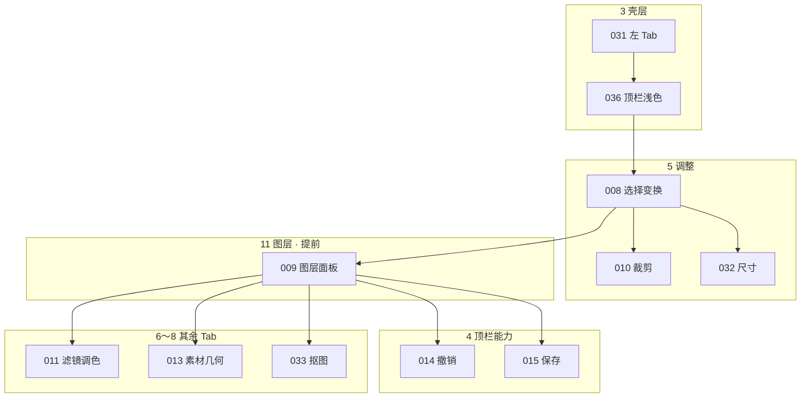

# 28–30 开发迭代路线 · Roadmap · 任务拆分

一次只做 `feature_list.json` 中一项。**编排以 `modules[].order` 为准**，不要按 feat 编号或旧 Phase A–I。

功能模块见清单顶部 `modules`；每条 feature 有 `module` 字段。壳层与左侧 Tab 的产品说明见 [1.2a](./README.md#12a-左侧工作区-tab功能归属)～[1.2c](./README.md#12c-美图风格布局与视觉)。

## 28 按模块交付

```text
1  工程底座     harness     已完成
2  画布底座     canvas      已完成（路由/四区/Pixi/导入/视口）
3  壳层布局     chrome      031 / 036 已归档
4  顶栏能力     toolbar     014 撤销 → 015 保存 → 029 高级导出
5  调整         adjust      008 选择 → 010 裁剪 → 032 尺寸
6  滤镜调色     color       011
7  素材         materials   013 几何 → 012 文字 → 026 贴纸
8  抠图         cutout      033 抠图换背景 → 024 蒙版（另项）
9  人像         portrait    034 调研
10 画笔         brush       035 调研
11 图层与对象   layers      009 列表（008 后尽早做，供 5～8 依赖）→ 023 特效 → 025 分组
12 质量         quality     016～018
13 工程演进     project     027 多页 → 028 序列化 → 030 AI
```

**依赖穿插：** `feat-009` 属图层模块，但是调整/滤镜/素材/抠图/顶栏撤销的前置。做完 008 后立刻做 009，再回到各 Tab，不要等模块 11 排到最后才做图层。



对外可交 ≈ 模块 3 + 5 + 4 的 014/015 + 6。素材几何可进可交包；贴纸/抠图为增强；人像/画笔只调研。

---

## 29 Feature 总表（按模块）

| 模块 | ID | 名称 | P | 状态 |
|---|---|---|---|---|
| 工程底座 | 001～002、019～022 | Harness / SDD / 文档 | P0 | done |
| 画布底座 | 003～007 | 路由、四区、Pixi、导入、视口 | P0 | done |
| 壳层布局 | 031 | 左六 Tab 壳 | P1 | done |
| 壳层布局 | **036** | 美图顶栏与浅色壳 | P1 | done |
| 顶栏能力 | 014 | 撤销重做 | P1 | not-started |
| 顶栏能力 | 015 | 导出/保存 | P1 | not-started |
| 顶栏能力 | 029 | 高级导出 | P2 | not-started |
| 调整 | 008 | 选择与变换 | P0 | not-started |
| 调整 | 010 | 矩形裁剪 | P1 | not-started |
| 调整 | 032 | 修改尺寸 | P1 | not-started |
| 滤镜调色 | 011 | 滤镜与调色 | P1 | not-started |
| 素材 | 013 | 矩形/圆 | P1 | not-started |
| 素材 | 012 | 文字 | P1 | not-started |
| 素材 | 026 | 贴纸置入 | P2 | not-started |
| 抠图 | 033 | 抠图与换背景 | P2 | not-started |
| 抠图 | 024 | 形状/Alpha 蒙版 | P2 | not-started |
| 人像 | 034 | 调研 | P3 | not-started |
| 画笔 | 035 | 调研 | P3 | not-started |
| 图层与对象 | 009 | 图层面板（008 后先做） | P1 | not-started |
| 图层与对象 | 023 | 特效 | P2 | not-started |
| 图层与对象 | 025 | 多选对齐分组 | P2 | not-started |
| 质量 | 016～018 | 性能 / 测试 / 键盘 | P1 | not-started |
| 工程演进 | 027 / 028 / 030 | 多页 / 序列化 / AI | P3 | not-started |

下一刀：**feat-008**（调整）。壳层 change 已归档。

---

## 30 开发任务拆分

按模块贴 Issue。实现仍一次一项 feature。

### 壳层布局

```text
CHR-001  顶栏左中右：品牌+打开 / 撤销重做 / 适配+保存
CHR-002  浅色 token：顶栏白、Tab 浅灰、host 浅灰、强调色粉红
CHR-003  左 Tab 选中态与顶栏主按钮同色
CHR-004  手工：host 面积、一块 canvas、打开/适配仍可用
```

feat-036（已归档）。

### 调整

```text
SEL-001～005   选择变换（008）
CROP-001～007  裁剪（010）
RSZ-001～003   尺寸（032）
```

### 顶栏能力

```text
HIS-001～006   撤销重做（014）
EXP-001～005   保存导出（015）
```

### 滤镜调色 / 素材 / 抠图

```text
FLT-001～006   滤镜调色（011）
SHP-001～005   素材几何（013）
TXT-001～005   文字（012）
AST-001～003   贴纸（026）
CUT-001～005   抠图换背景（033）
MSK-001 起     蒙版（024，勿与 CUT 混项）
```

### 图层与对象

```text
LYR-001～003   图层面板（009，008 后立刻做）
FX-001 起      特效（023）
```

### 人像 / 画笔（调研）

```text
POR-000  人像（034）
BRH-000  画笔（035）
```

### 质量 / 工程

```text
PERF-001～003
TST-001～002
KEY-001～003
SAV / PAGE / AI  见 027～030
```

### 每条 Issue 的完成链

```text
需求（feature_list.module + OpenSpec）
 → 技术设计（中文 design.md + mermaid）
 → 数据模型 → store / Command → Vue UI（顶栏或对应 Tab）
 → scene sync → ./init.sh + 归档 + docs/editor/<模块>.md
```

---

## 附录：现有代码对照（勿推翻）

| 能力 | 代码 | 决策 |
|---|---|---|
| Application | `src/editor/core/usePixiApp.ts` | 【保持】 |
| 场景图 | `scene/createSceneGraph.ts` | 【保持】 |
| 导入 | `assets/loadLocalImage.ts` | 【保持】；按钮在顶栏左 |
| 视口 | `viewportMath` + `useViewportGestures` | 【保持】；适配在顶栏右 |
| 工作区 Tab | `workspaceTabs` + `EditorWorkspaceNav` | 【保持】结构；036 改肤色 |
| 顶栏 | `EditorToolbar.vue` | 【建议新增】036 三分区 + 浅色 |
| 文档 | `store/editor.ts` | 【保持】真源 |
