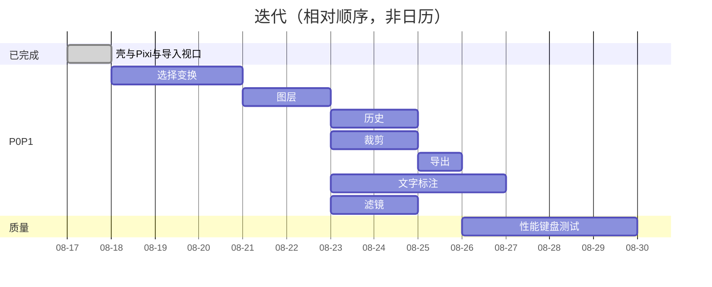

# 28–30 开发迭代路线 · Roadmap · 任务拆分

一次只做 `feature_list.json` 中一项。人日为单人估算，含 TDD 与 `./init.sh`，不含无尽打磨。

## 28 开发迭代路线

提示词 Phase 0 的 Scene/Object/Event 已部分落地。下表从**当前仓库真实进度**起算，不假装从零写内核。

```text
已完成 ≈ 提示词 Phase 0 的壳 + Application + 导入 + 视口
Phase A  选择变换 + 图层          ← 当前主路径
Phase B  裁剪 + 导出 + 历史
Phase C  文字 + 标注形状
Phase D  滤镜调色
Phase E  质量（性能/测试/键盘）
Phase F  特效蒙版
Phase G  素材模板
Phase H  高级导出
Phase I  AI（演进）
```



### Phase A — 对象可操作（P0）

| 项 | 内容 |
|---|---|
| 目标 | 能选中并改 transform；多层列表真源 |
| 功能 | feat-008、feat-009 |
| 技术任务 | SEL-*、LYR-* |
| 前置 | feat-007 已归档 |
| 验收 | 手柄在视口缩放后仍准；锁定不可变；面板与画布一致 |
| 风险 | 坐标系缠在一起 — 只改 layer.transform，手柄 world 空间 |
| 复杂度 | 4.5 人日 |

### Phase B — 闭环可交（P1）

| 项 | 内容 |
|---|---|
| 目标 | 裁剪非破坏；撤销；导出无 overlay |
| 功能 | feat-010、feat-014、feat-015 |
| 前置 | 008；014 依赖 009；015 可在 006 后草图 |
| 验收 | 裁剪后可变换；Ctrl+Z 覆盖变换/图层/裁剪；PNG/JPEG 无手柄且分辨率对 |
| 风险 | extract+filter；objectURL 与 undo 的 revoke 时机 |
| 复杂度 | 5 人日 |

### Phase C — 文字与标注（P1）

feat-012、feat-013。前置 008/009。验收：文字与笔画可再选中。风险：Text 重栅格；画笔点过多。复杂度 3.5 人日。

### Phase D — 滤镜（P1）

feat-011。前置 009。验收：滑条预览=导出、可重置。风险：大图 filter pass。复杂度 1.5 人日。

### Phase E — 可养（P1）

feat-016、017、018。前置 005/014/008。验收：进出无泄漏、纯逻辑测试绿、方向键与 Tab。复杂度 4 人日。

### Phase F — 蒙版与特效（P2）

独立于现 feature 列表时可新增 feat。blend/shadow/ellipse mask。复杂度 4～6 人日。

### Phase G — 素材与模板（P3）

【后续演进】Asset 模型，置入仍为 Layer。

### Phase H — 高级导出（P2/P3）

2x、WebP、超大图降级。PDF/分块【后续演进】。

### Phase I — AI（P3）

【后续演进】当作**异步服务结果写回图层**，不进 Pixi 内核，不推翻 Pinia。

---

## 29 Feature Roadmap

| ID | 名称 | P | 状态 | Phase |
|---|---|---|---|---|
| feat-003～007 | 壳、Pixi、导入、视口 | P0 | done | 已完成 |
| feat-008 | 选择与变换 | P0 | not-started | A |
| feat-009 | 图层面板 | P1 | not-started | A |
| feat-010 | 裁剪与蒙版 | P1 | not-started | B |
| feat-014 | 撤销重做 | P1 | not-started | B |
| feat-015 | 导出 | P1 | not-started | B |
| feat-012 | 文字 | P1 | not-started | C |
| feat-013 | 矢量标注 | P1 | not-started | C |
| feat-011 | 滤镜调色 | P1 | not-started | D |
| feat-016 | 性能释放 | P1 | not-started | E |
| feat-017 | 纯逻辑测试补齐 | P1 | not-started | E |
| feat-018 | 键盘与无障碍 | P1 | not-started | E |
| — | 混合/阴影/分组 | P2 | 未立项 | F |
| — | 素材库/模板/多页 | P3 | 未立项 | G |
| — | AI | P3 | 未立项 | I |

P0：没有就不能称编辑器。P1：对外可交（M4）。P2：增强。P3：演进，架构预留字段即可。

插件化：滤镜预设、导出 mime、形状工具注册表。不可插件化：坐标、sync、History 内核、Application 生命周期。

---

## 30 开发任务拆分

可直接贴 Issue。实现顺序仍一次一项 feature。

### 立即（Phase A）

```text
SEL-001  selectedIds + transformMath TDD
SEL-002  overlay 包围盒与手柄
SEL-003  移动 / 等比缩放 / 旋转手势
SEL-004  与平移工具/空格/中键互斥
SEL-005  锁定层拒绝变换
LYR-001  layers[] 多实例（打破「仅一张主图」）
LYR-002  图层面板显隐锁定排序重命名
LYR-003  sync zIndex / visible / eventMode
```

### 闭环（Phase B）

```text
CROP-001～007  见 04 裁剪章
HIS-001～006   见 05 历史章
EXP-001～005   见 05 导出章
```

### 编辑（Phase C/D）

```text
TXT-001～005
ANN-001～006
FLT-001～006
```

### 质量（Phase E）

```text
PERF-001  删层销毁 texture + unload
PERF-002  进出页泄漏检查清单
PERF-003  大图 cullable（若 GPU bound）
TST-001   命令栈 spec
TST-002   裁剪/导出纯函数 spec
KEY-001～003
```

### 每条 Issue 的完成链

```text
需求（feature_list + OpenSpec）
 → 技术设计（中文 design.md + mermaid）
 → 数据模型（types.ts + 失败 spec）
 → store action / Command
 → Vue UI（不 import pixi）
 → scene sync / Pixi
 → History（若该 feat 已有栈）
 → 测试（TDD 或手工）
 → 性能（大图/释放）
 → ./init.sh + 归档 + docs/editor/<模块>.md
```

---

## 附录：现有代码对照（勿推翻）

| 能力 | 代码 | 决策 |
|---|---|---|
| Application | `src/editor/core/usePixiApp.ts` | 【保持】 |
| 场景图 | `scene/createSceneGraph.ts` | 【保持】 |
| 导入 | `assets/loadLocalImage.ts` | 【保持】 |
| 视口 | `model/viewportMath.ts` + `tools/useViewportGestures.ts` | 【保持】 |
| 文档 | `store/editor.ts` | 【保持】真源；扩展字段而非新 store |
| 类型 | `model/types.ts` | 【建议优化】扩展联合类型 |
| EditorEngine 类 | 无 | 【后续演进】仅门面 |
