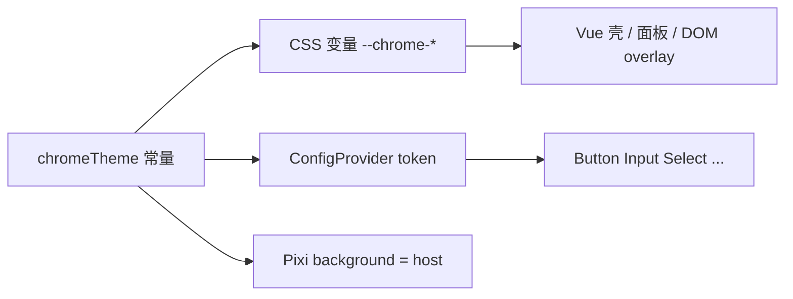

# 编辑器 UI 设计规范

给人、给 Agent 执行的视觉与交互规范。信息架构已由壳层锁定（美图左 Tab + 顶栏三分区 + 浅色）；本文规定**怎么画、用哪些控件、token 从哪读**。

行为契约仍以 `openspec/specs/` 为准。本文不要整份灌进主 spec。落地实现对应 chrome 模块新 feat（规划见 OpenSpec change `add-editor-ui-spec`）。

相关文档：[`editor-plan.md`](./editor-plan.md) 第 4 节 · [`handbook/02-product-research.md`](./handbook/02-product-research.md) · [`../editor/shell.md`](../editor/shell.md)

---

## 1. 目的与范围

| 覆盖 | 不覆盖 |
|---|---|
| 色板 / 字号 / 间距 / 圆角 / 动效 token | 完整设计系统、Figma 组件库 |
| 壳层模式（顶栏、左 Tab、面板、空态） | 换品牌、暗色主题 |
| Ant Design Vue 主题与白名单 | 二次封装 `EditorButton` 一类包装层 |
| IconPark 用法 | 引入第二套图标库 |
| 画布 overlay 分工与视觉 token | 把裁剪从 DOM 迁到 Pixi；feat-008 手柄交互逻辑 |
| 状态色、toast、字段错误、focus 底线 | 完整键盘地图 / 读屏（feat-018） |
| 浅色桌面、最低宽度 | 响应式折叠四区、移动端 |

**读者：** 实现壳层与面板的人；写 Vue 的 Agent。改产品行为仍须先有 OpenSpec change。

---

## 2. 原则

1. **延续现有身份。** 白顶栏、Tab `#f5f5f5`、画布 `#ebebeb`、强调 `#ff4d6d`。不换皮。
2. **一份 token，两处消费。** `chromeTheme`（或其后继模块）是唯一真源，同时导出 CSS 变量和 Ant `ConfigProvider.theme.token`。Pixi 空舞台 `background` 必须等于 host 色。组件样式禁止再写裸 hex / 随意 `rgb()`。
3. **Ant 管控件，自制管壳。** 表单控件用白名单内的 Ant 组件；左 Tab、手风琴、空态、画布 HUD 自制。
4. **图标独占 Park。** `@icon-park/vue-next`，outline，颜色走 `currentColor`。
5. **画布跟手，壳层可以短过渡。** 框、手柄、视口禁止 CSS/Pixi 过渡。
6. **分层不破。** UI / store 禁止 `import 'pixi.js'` 或持有 DisplayObject。导出不含 overlay。

---

## 3. Token 真源



- 新增颜色、间距、圆角、字号、动效时长，只加在 token 模块，再映射出去。
- 测试：host 色、强调色、字号阶、间距阶用 vitest 锁常量；不测 WebGL 帧。
- 全局 `src/style.less` 不得再定义与壳层冲突的暗色 `color-scheme` / `prefers-color-scheme` 字色。

### 3.1 CSS 变量名

| Token | CSS 变量 | 值 |
|---|---|---|
| 强调 | `--chrome-accent` | `#ff4d6d` |
| 选中浅底 | `--chrome-accent-bg` | `rgb(255 77 109 / 12%)` |
| 表面 | `--chrome-surface` | `#ffffff` |
| Tab 列 | `--chrome-tab-rail` | `#f5f5f5` |
| 画布 host | `--chrome-host-bg` | `#ebebeb` |
| 主文字 | `--chrome-text` | `rgb(0 0 0 / 88%)` |
| 次文字 | `--chrome-text-secondary` | `rgb(0 0 0 / 45%)` |
| 三级 / 禁用字 | `--chrome-text-disabled` | `rgb(0 0 0 / 25%)` |
| 分割线 | `--chrome-border` | `rgb(0 0 0 / 6%)` |
| Hover 底 | `--chrome-hover-bg` | `rgb(0 0 0 / 4%)` |
| Hover 字 | `--chrome-text-hover` | `rgb(0 0 0 / 75%)` |
| 成功 | `--chrome-success` | `#52c41a` |
| 警告 | `--chrome-warning` | `#faad14` |
| 错误 | `--chrome-error` | `#ff4d4f` |
| overlay 遮罩 | `--chrome-overlay-mask` | `rgb(0 0 0 / 45%)` |
| overlay 描边 | `--chrome-overlay-stroke` | `#ffffff` |
| overlay 井字 | `--chrome-overlay-grid` | `rgb(255 255 255 / 70%)` |
| 控件圆角 | `--chrome-radius-control` | `6px` |
| 卡片圆角 | `--chrome-radius-card` | `8px` |
| 动效 | `--chrome-motion` | `150ms` |

错误色不得改成与强调色相同。强调偏粉，错误走 Ant 默认红。

### 3.2 Ant `ConfigProvider` 映射

| Ant token | 来源 |
|---|---|
| `colorPrimary` | 强调 |
| `colorSuccess` / `colorWarning` / `colorError` | 上表 |
| `colorText` / `colorTextSecondary` / `colorTextDisabled` | 主 / 次 / 禁用字 |
| `colorBorder` / `colorSplit` | 分割线 |
| `colorBgContainer` | 表面 |
| `colorBgLayout` | host 浅灰（布局底，不是强调） |
| `borderRadius` | 6 |
| `fontSize` | 12 |
| `fontFamily` | 见第 5 节 |
| `controlHeight` | 随 `componentSize: 'small'`（24） |
| `motionDurationMid` | `0.15s` |

编辑器根 `ConfigProvider` 必须设 `componentSize="small"`。`Modal` 与 `message` 保持 Ant 默认尺寸，不强制 small 对话框。

---

## 4. 字体与密度

**字体栈（不引入 Web 字体文件）：**

```
-apple-system, BlinkMacSystemFont, "PingFang SC", "Microsoft YaHei",
"Segoe UI", Roboto, "Helvetica Neue", Arial, "Noto Sans", sans-serif
```

| 角色 | 字号 | 字重 | 用途 |
|---|---|---|---|
| 辅助 | 11px | 400 | 左 Tab 文案 |
| 正文 | 12px | 400 | 表单标签、hint、面板正文 |
| 分组标题 | 13px | 600 | 右侧「图层 / 属性」、手风琴标题 |
| 品牌 | 14px | 600 | 顶栏「编辑器」 |

行高随 Ant small，不要在每个组件里另写 `line-height: 52px` 一类魔法数（顶栏高度用布局 token，见第 6 节）。

---

## 5. 间距、圆角、图标尺寸

**间距只准 4 / 8 / 12 / 16 px**（以及由它们相加得到的布局宽，如左栏 64+220）。禁止再发明 6、10、14。

| 场景 | 值 |
|---|---|
| Tab 项内 gap、紧凑堆叠 | 4 |
| 按钮组、字段内标签与控件 | 8 |
| 面板内边距、区块 gap | 12 |
| 右栏区块之间 | 16 |

| 圆角 | 值 |
|---|---|
| 按钮、输入、Tab 项 | 6 |
| 手风琴卡片、分组容器 | 8 |

| 图标 | 尺寸 | 场景 |
|---|---|---|
| 内联 | 14 | 面板内动作、字段旁 |
| 顶栏 | 16 | 打开 / 撤销 / 适配等（若使用图标） |
| 左 Tab | 18 | 工作区分类 |

---

## 6. 布局尺寸（冻结）

本规范**不改**四区像素，只记录以免被「优化」掉。

| 区域 | 值 |
|---|---|
| 顶栏高 | 52px |
| 左 Tab 列宽 | 64px |
| 左工作区面板宽 | 220px |
| 左栏合计 | 284px |
| 右栏宽 | 240px |
| 桌面最低宽度 | 1280px |

低于 1280px **不折叠**四区、不隐藏右栏。不为暗色出第二套 token。

---

## 7. 动效

| 层 | 规则 |
|---|---|
| 壳层 | hover / 背景 / 按钮：≤150ms，与 `--chrome-motion` 一致 |
| 手风琴 | 允许即时展开（`v-if`），不要做高度动画 |
| 画布 | 裁剪框、选中框、手柄、视口平移缩放：**禁止**过渡。位置跟指针或文档数值 |

---

## 8. Ant Design Vue 白名单

**允许：** `ConfigProvider`、`Layout`、`Space`、`Button`、`Input`、`InputNumber`、`Select`、`Slider`、`Switch`、`Checkbox`、`Radio`、`Tooltip`、`Dropdown`、`Modal`、`message`。

**禁止：** `Table`、`Menu`、`Tabs`（工作区 Tab 已自制）、`DatePicker`、`Form` 的重型布局（`Form.Item` 大表单）、`Pagination`、`Transfer`、`Tree`、`Cascader`。

需要白名单外的组件时，先改本规范再开 change，不要在面板里先用再说。

控件默认 `size="small"`（根 `componentSize` 已覆盖时仍须避免局部写成 `middle` / `large`）。主操作（保存）`type="primary"`。顶栏次要操作为 `default`。

---

## 9. 图标

- 库：只准 `@icon-park/vue-next`。禁止 `@ant-design/icons` 与随意内联彩色 SVG。
- 主题：一律 `theme="outline"`。选中态**不**切换 filled，只改 `color`（继承 `currentColor` → 强调色）。
- 缺图标：先在 Park 找语义接近的替换；没有则本地 SVG，viewBox 24、描边粗细与 Park outline 一致，并记入 [附录 A](#附录-aiconpark-目录)。
- 工作区 Tab 现用映射见附录 A。

---

## 10. 壳层模式

### 10.1 顶栏（胶囊模式）

> 完整交互与状态机见 [`toolbar-capsule-prd.md`](./toolbar-capsule-prd.md)。

**结构：** 左「品牌 + 导入」、中「胶囊工具条」、右「导出」。三列 grid：`1fr auto 1fr`。底部分割线 `--chrome-border`。高度 52px，背景 `--chrome-surface`。

| 区域 | 内容 | 说明 |
|---|---|---|
| 左 | 品牌「编辑器」+ 导入图标 | 仅此处与右区在胶囊外 |
| 中 | 单颗胶囊 | 白底、1px `--chrome-border`、高度约 32px、圆角约 16px（`--chrome-radius-pill`） |
| 右 | 导出图标 | `type="primary"`；feat-015 前 **disabled** 占位 |

**胶囊内分组（固定顺序）：** 抓手 `|` 撤销 · 重做 `|` 对比原图 `|` 适配。组间 1px 竖线（`--chrome-border`），组内间距 8px。

**控件形态：** 胶囊内与导入/导出均为 IconPark outline 16px + Ant Tooltip；**禁止**文字按钮（品牌字除外）。粘滞开关（抓手）选中用强调色；按住态（对比原图）按下时强调色。有快捷键的控件，Tooltip 须带键名（如 `抓手 空格`、`对比原图 \`）。禁用态须用 `--chrome-text-disabled` 明显变淡，禁止 `color: inherit` 盖掉禁用色。

**平移入口：** 抓手在顶栏胶囊；**【调整】面板不再提供平移按钮**。空格暂切、中键平移行为不变（见 `viewport-navigation` spec）。

**对比原图：** 按住胶囊按钮或 `\` 为视图态预览导入位图；不写文档、不进撤销栈；对比期间隐藏 DOM 裁剪 overlay。

### 10.2 左 Tab

竖列、图标在上文字在下。未选：次文字色、透明底。Hover：`--chrome-hover-bg` + `--chrome-text-hover`。选中：强调色 + `--chrome-accent-bg` + 左侧 2px 强调条。保留 `aria-selected`。

### 10.3 工作区面板

白底、内边距 12。手风琴：卡片圆角 8、1px `--chrome-border`。标题 13/600，右侧折叠指示用 IconPark（如 `Down` / `Right`），**禁止**再用 `∨` / `>` 字符箭头。

### 10.4 空态

- 画布无图：host 上「拖入或点击打开」（已有行为，文案保持）。
- 未实现工作区：标题 +「即将推出」类占位，不接线业务。
- 右侧无图层：12px 次文字 hint。空态不使用插画和大按钮堆砌。

### 10.5 Focus

可点击控件必须有可见 focus 环：2px 强调色描边（或 Ant `controlOutline`）。不要 `outline: none` 后不补。

---

## 11. 画布 overlay

| 类型 | 实现 | 例子 |
|---|---|---|
| 跟图层走、导出须剔除 | Pixi `world.overlay` | 选中包围盒、变换手柄、对齐辅助线（feat-008） |
| 会话型、需要 HTML | DOM，叠在 host 上 | 裁剪框（已有）、文字编辑 textarea、画布底部确认条 |

**视觉 token（两套实现共用）：**

| 项 | 值 |
|---|---|
| 角手柄 | 8×8px，白填充，1.5px 强调描边（屏幕空间，不随视口变细） |
| 边中点 | 16×6 胶囊，填充与描边同上（便于命中） |
| 框线 | 1.5px 白或强调；裁剪框可用白线 + 外遮罩 |
| 遮罩 | `--chrome-overlay-mask`（45% 黑） |
| 井字线 | `--chrome-overlay-grid`，仅拖动时出现 |

裁剪维持 DOM，本规范**不要求**迁到 Pixi。现实现角点 10px、无强调描边，属历史值；后续收敛到本表，第一刀实现**不强制**改 `CropOverlay` 像素。

禁止为对齐手柄每帧重建纹理。手柄视觉尺寸按屏幕像素，文档空间要除以 `viewport.scale`（feat-008 实现时遵守）。

---

## 12. 状态与反馈

| 状态 | 表现 |
|---|---|
| 默认 | 主/次文字、白表面 |
| Hover | 轻底或 Ant 控件默认 hover |
| 选中 | 强调色 |
| 禁用 | `--chrome-text-disabled`，控件 `disabled` |
| 加载 | Ant `Button` loading；不要自制转圈 |
| 空 | 第 10.4 节 |
| 错误 | `--chrome-error`；字段错误写在控件下方 11/12px，不打断画布 |

**反馈通道：**

- 短暂结果（导入失败、导出失败）：`message`。不用 `notification`。
- 字段不合法：控件下内联错误，不弹 Modal。
- 破坏性确认：`Modal.confirm`。
- 成功一般静默（撤销/适配不必 toast），除非用户离开当前上下文（导出完成可用 `message.success`）。

---

## 13. 分层与 z-index

| 层 | z-index |
|---|---|
| Pixi canvas | 文档流 |
| DOM 裁剪 / 文字编辑 overlay | 2（相对 host） |
| 壳层顶栏 / 侧栏 | 布局层，不盖住 Modal |
| Ant Modal | 库默认（1000） |
| Ant message | 库默认（高于 Modal） |

DOM overlay 必须 `pointer-events` 只开在框与手柄上，遮罩区把事件留给视口平移（现裁剪已如此）。

---

## 14. Agent 检查清单

写编辑器 UI 前自问：

- [ ] 颜色 / 间距 / 圆角是否全部来自 chrome token 或 CSS 变量？
- [ ] 新增 Ant 组件是否在白名单内？是否 `small`？
- [ ] 图标是否为 IconPark outline + `currentColor`？
- [ ] 是否误用 `Tabs` / `Table` / `Menu` 做壳层？
- [ ] 画布框是否加了 CSS transition？
- [ ] 是否 `import 'pixi.js'`？
- [ ] 空态 / 禁用 / 错误走了第 12 节通道？
- [ ] 是否为暗色或窄屏写了另一套布局？

---

## 15. 第一刀实现范围

完整表格以本文为准。第一刀代码只做「规范可执行」：

- 扩展 token 模块并映射 CSS 变量 + `ConfigProvider`（含 `componentSize`、字体栈、状态色）
- 编辑器壳去掉裸 hex（顶栏、Tab、Layout、调整面板卡片等）
- 漏网控件改为 small（如改尺寸 `Input`）
- 手风琴圆角收到 8；折叠箭头改为 IconPark
- 清掉 `style.less` 与壳层冲突的 Vite 暗色残留

**第一刀不做：** Figma、暗色、裁剪改 Pixi、feat-008 手柄、全面重写调整面板文案与 CropOverlay 手柄像素。

---

## 附录 A：IconPark 目录

| 用途 | 组件 | 备注 |
|---|---|---|
| 调整 | `Adjustment` | 已用 |
| 滤镜调色 | `ColorFilter` | 已用 |
| 人像 | `People` | 已用 |
| 抠图 | `Cutting` | 已用 |
| 画笔 | `Paint` | 已用 |
| 素材 | `Pic` | 已用 |
| 手风琴展开 | `Down` | 替换 `∨` |
| 手风琴收起 | `Right` | 替换 `>` |
| 导入 | `FolderOpen` | 顶栏左区 |
| 抓手 | `Five` | 顶栏胶囊 |
| 撤销 | `Undo` | 顶栏胶囊 |
| 重做 | `Redo` | 顶栏胶囊 |
| 对比原图 | `Contrast` | 顶栏胶囊；按住交互 |
| 适配 | `FullScreen` | 顶栏胶囊 |
| 导出 | `Save` | 顶栏右区；disabled 占位 |
| 锁定比例 | `Lock` / `Unlock` | 改尺寸 |

增补本地 SVG 时在本表追加一行，并注明路径。
