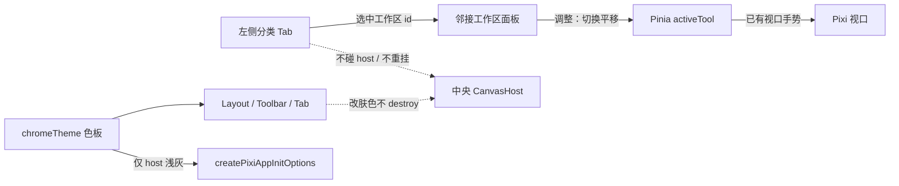
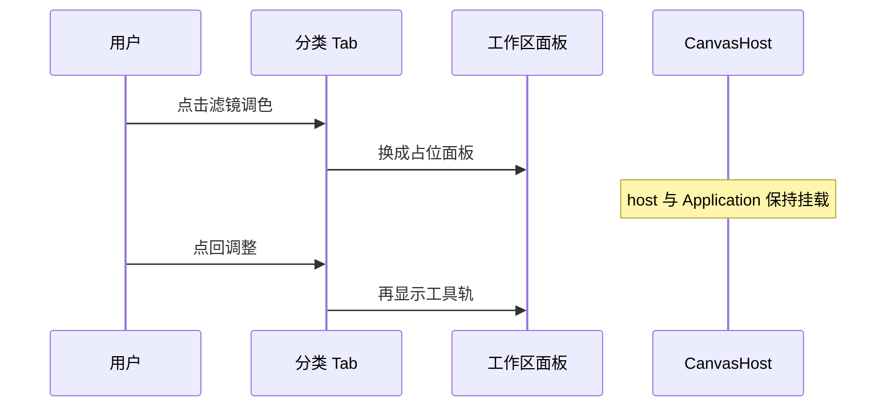
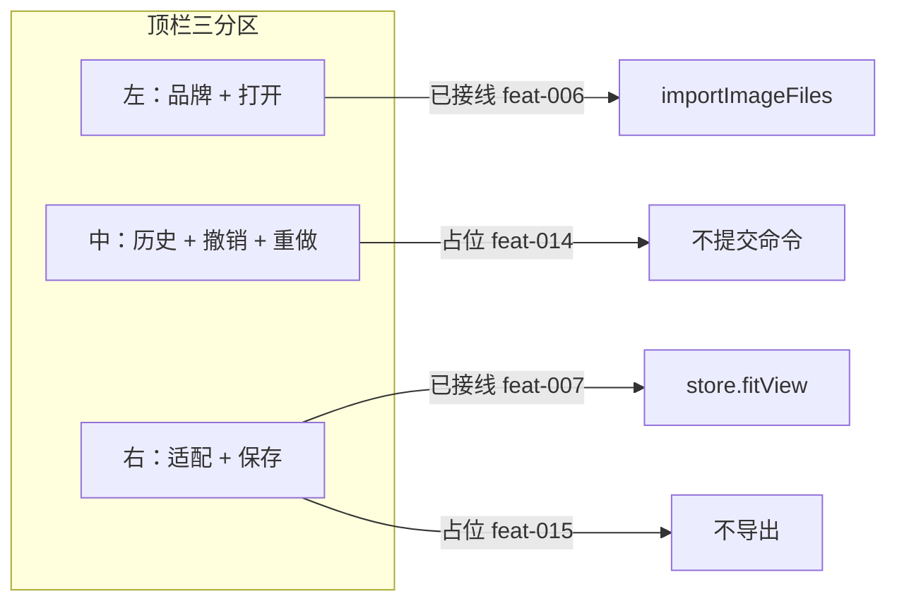

## 背景

现有四区壳见 `docs/editor/shell.md`：`EditorLayout` 左侧已加宽为 Tab + 面板（feat-031 已落代码）。中央 `#pixi-host` 由 `usePixiApp` `resizeTo`，切换左侧 UI 或改肤色时不得卸载 host。Pinia 文档仍是唯一业务真源。本 change 在同一条上补齐 feat-036：顶栏三分区与浅色美图气质。动机见 `proposal.md`。

## 目标 / 非目标

**目标：**

- 左侧改为「图标 Tab 列 + 邻接工作区面板」双列，目录与默认项由可测纯函数给出
- Tab 选中只改壳层 UI 状态，不写入文档、不触发 scene sync、不重挂 Pixi
- `EditorToolRail` 收进 **调整** 面板，平移契约不变
- 顶栏改为左文档 / 中历史 / 右交付；打开与适配保持已接线
- 浅色 token：顶栏白、Tab 列浅灰、host 与 Pixi 背景 `#ebebeb`；选中 Tab 与保存主按钮共用强调色
- 左栏加宽、改肤色后 host 仍有可测面积

**非目标：**

- 不为未落地工作区写滤镜 / 人像 / 抠图 / 画笔 / 素材实现
- 不把 Tab 选中或肤色做成 Pinia 文档字段或可序列化工程状态
- 不接线撤销栈或真实保存 / 导出
- 不抄会员、头像、云优化
- 不把 Pixi 舞台涂成粉红

## 数据流与分层

本变更落在 **UI 壳层**，色板与目录落在 **model 纯函数**。邻居契约：Tab / 顶栏目录用 model；调整面板继续调 `useEditorStore.setActiveTool`；画布仍只认 `#pixi-host`；Pixi init 只读 host 背景 token，不读强调色。

| 层 | 本变更做什么 | 公开契约 |
|---|---|---|
| model | Tab 目录、默认项、是否已实现；顶栏分区；壳层色板 | `WorkspaceTabId`、`listWorkspaceTabs()`、`DEFAULT_WORKSPACE_TAB`、`isWorkspaceImplemented()`、`listToolbarRegions()`、`CHROME_*` |
| UI | Tab 栏 + 面板切换；顶栏三分区；浅色 CSS 变量 | Vue `emit` 选中 id；调整面板继续用 store `setActiveTool` |
| core | init `background` 跟 host 色板 | `createPixiAppInitOptions` |
| Pinia / scene | 不改文档与场景 | 平移仍只认 `activeTool === 'pan'` |

## 决策

### 决策 1：Tab 选中留在 UI，不进文档

- **结论：** 当前选中的工作区 id 由左侧组装组件的 `ref` 持有，刷新后回到默认 **调整**。
- **理由：** 这是浏览壳状态，不是图层 / 视口；proposal 禁止把它写成可导出工程。
- **弃用方案：** 写进 `useEditorStore`。会暗示它是文档真源，后续序列化还要再剔除。

### 决策 2：目录抽成 model 纯函数，先红后绿

- **结论：** 在 `src/editor/model/workspaceTabs.ts` 固定六项顺序与默认 id；顶栏分区与色板放 `src/editor/model/chromeTheme.ts`；`*.spec.ts` 同目录。
- **理由：** 标签文案、「谁已实现」、分区顺序和色值是可测逻辑；UI 只渲染。
- **弃用方案：** 把六项或色值写死在多个 Vue 模板。后续接线时容易和 spec 漂移。

### 决策 3：组件按职责拆，不堆进 Layout

- **结论：**
  - `EditorWorkspaceNav`：组装 Tab 列 + 面板，持有选中 id
  - `EditorWorkspaceTabs`：只渲染六项并 `emit` 选中
  - 已实现：沿用 `EditorToolRail` 作为调整面板
  - 未实现：共用占位面板（标题 + 「即将推出」）
  - `EditorToolbar`：只排左中右三区，打开 / 适配仍在本组件接线
  - `EditorLayout` 只加宽左侧 `Sider`（约 Tab 64px + 面板 220px）并挂 CSS 变量，不写业务
- **理由：** 单文件约 200 行即拆；Layout 继续只做排版。
- **弃用方案：** 把 Tab、六块面板和顶栏全写进 `EditorLayout` 或一个上帝组件。

### 决策 4：切换 Tab 与改肤色只用条件渲染面板，不动 CanvasHost

- **结论：** `EditorPage` 仍把 `CanvasHost` 放在中央 slot；左侧 `v-if` / `v-show` 只包工作区面板。改 token 只改 CSS 与 init 选项默认值，不卸载 host。
- **理由：** spec 要求同一 host、同一块 canvas；卸载 host 会让 `usePixiApp` 走 destroy/再 init。
- **弃用方案：** 按 Tab 整页换路由或重挂 `EditorPage`。

### 决策 5：浅色壳，选中与保存共用强调色

- **结论：** 顶栏白底；Tab 列浅灰；二级面板与右侧白底深字；host 与 Pixi `background` 均为 `#ebebeb`。选中 Tab 左边条 / 字色与「保存」主按钮共用同一粉/红强调色（如 `#ff4d6d`）。舞台不用强调色。
- **理由：** handbook 1.2c 已改口学美图气质；粉红舞台会脏图。色值集中在 `chromeTheme`，Layout 用 CSS 变量下发，避免 UI 与 Pixi 各写一份灰。
- **弃用方案：** 继续深色壳；或把 Ant Design 全局 theme 改成第二套文档状态。

### 决策 6：顶栏三分区，能力仍按原 feature 接线

- **结论：** 左品牌 + 打开（feat-006 已接线）；中历史入口占位 + 撤销 / 重做（feat-014 前禁用）；右适配（feat-007 已接线）+ 保存主按钮（feat-015 前禁用）。不放 VIP / 头像。
- **理由：** 布局一次改完，避免后续每个顶栏 feat 再拆排版。
- **弃用方案：** 保持一排 `Space` 深色按钮；或本项偷偷接线撤销 / 导出。

## 风险与权衡

- [左栏加宽后窄窗口下 host 塌成 0] → Sider 固定宽度、中央 `min-width: 0; flex: 1`；桌面窗口手工拉到约 1280 宽确认 host 仍有面积
- [用 `v-if` 切整个 Layout 导致 Pixi 卸载] → 禁止把 `CanvasHost` 放进 Tab 条件块；切换只改左侧面板
- [改肤色重挂 Application] → 不按 theme 重建 `EditorPage` / `CanvasHost`；只改 CSS 变量与 init 默认背景
- [占位 Tab / 历史 / 保存看起来可操作] → 未接线控件保持 disabled 或文案「即将推出」，不放假滑条
- [jsdom 量不到双列真实像素] → 单元测试只锁目录 / 默认项 / 色板 / 分区；布局与 host 走手工
- [全局 `style.less` 仍是深色字] → 编辑器壳用自身字色覆盖；不把整站 Vite 模板皮肤当成文档状态

## 验证策略

**TDD（先红后绿）：**

- `listWorkspaceTabs()` 顺序与文案为 调整 → 滤镜调色 → 人像 → 抠图 → 画笔 → 素材
- 默认 id 为调整；仅调整视为已实现
- `listToolbarRegions()` 顺序为 文档 → 历史 → 交付
- host 背景 token 为 `#ebebeb`；强调色为同一粉/红值
- `createPixiAppInitOptions` 的 `background` 等于 host 背景 token

**手工（画布 / 布局，不写 WebGL unit spec）：**

- `/editor` 四区可见；默认调整；平移仍可用
- 点 滤镜调色 / 人像 等只换左侧面板，画布上一块 canvas，导入图不消失
- 顶栏可见左中右：打开可用、适配可用、历史 / 撤销 / 重做 / 保存禁用；保存为强调色主按钮
- 壳为浅色；选中 Tab 与保存同色；host 浅灰，舞台不是粉红
- 窗口缩放后 host 仍在中央且宽高非 0
- 改肤色后仍是一块 canvas，不重挂

## 迁移与回滚

无运行时数据迁移。落地：先目录 / 色板 spec 与 helper，再拆 UI、加宽 Layout、改顶栏与浅色。回滚：恢复深色 Layout、单列 `EditorToolRail` 与一排顶栏按钮，删除工作区目录、导航组件与 `chromeTheme`。

## 未决问题

无。
