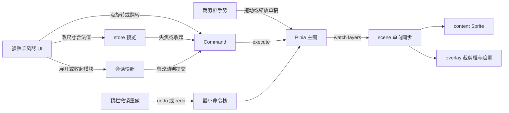
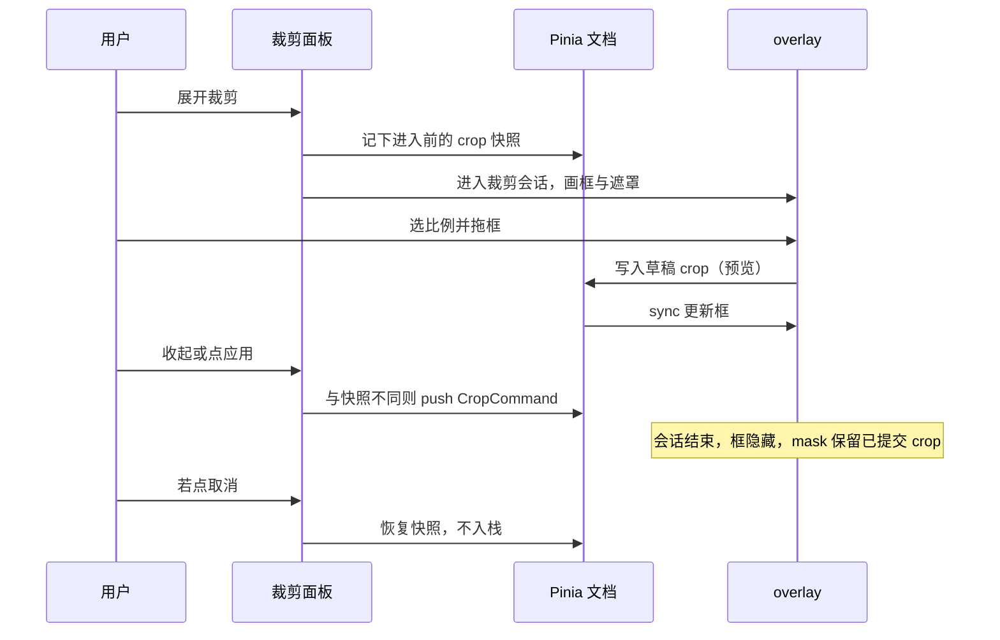
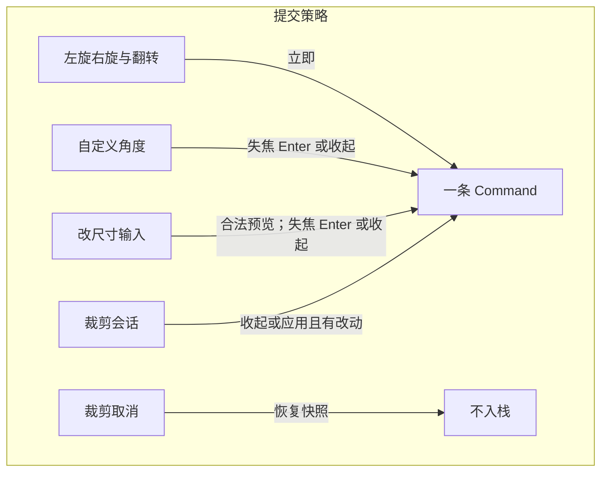

## 背景

主图已在 Pinia `layers[0]`（`ImageLayer`：`objectUrl`、`naturalWidth/Height`、`transform`），scene 按 id 同步到 content 里的 Sprite（`anchor 0.5`）。overlay 容器已有，但未画任何框。调整面板目前是 `EditorToolRail`：平移可用，选择 / 裁剪 / 文字 / 形状为禁用占位。没有 Command 栈；顶栏撤销 / 重做按钮存在但禁用。分层约束见 `docs/editor/architecture.md`：UI 禁止 `import 'pixi.js'`，文档是唯一业务真源。

本期不引入 feat-008 的选中态与变换手柄。动机见 `proposal.md`。

## 目标 / 非目标

**目标：**

- 在现有 `ImageLayer` 上扩展 crop / 翻转字段，用同一套 `transform` 表达旋转与显示缩放
- 调整面板改为互斥手风琴；裁剪会话、旋转点击、改尺寸输入分别按「预览 → 提交 Command」落地
- 裁剪框与遮罩画在已有 overlay；sync 用 mask 表现非破坏裁剪
- 最小命令栈只覆盖本三项，顶栏撤销 / 重做接到该栈
- 单位换算、锁比例、角度归一化、裁剪矩形约束全部是可测纯函数

**非目标：**

- 不建第二套 Object Model / 第二文档 store
- 不在 Vue 组件里改 Sprite
- 不实现画布包围盒与自由变换
- 不把导入替换、滤镜、文字纳入本栈（feat-014）
- 不改 Pixi `Application` 生命周期

## 数据流与分层

本变更落在 **model 纯函数、最小 history、Pinia action、调整 UI、tools 裁剪手势、scene 单向同步**。邻居契约：面板只调 store 公开 action；裁剪手势只发 action / Command；sync 只读 `ImageLayer`。

| 层 | 本变更做什么 | 公开契约 |
|---|---|---|
| model | 比例列表、裁剪矩形 clamp、角度归一化、单位换算、锁比例、显示尺寸 ↔ scale | `CropRect`、`listCropRatios()`、`clampCropRect`、`normalizeDegrees`、`pxFromUnit` / `unitFromPx`、`sizeFromScale` / `scaleFromSize` |
| history | Command 接口与线性栈 | `EditorCommand`、`push` / `undo` / `redo` |
| Pinia | 主图仍 `layers[0]`；更新 crop / rotation / flip / scale；持有栈 | `setMainCrop`、`rotateMain`、`flipMain`、`setMainDisplaySize`、`undo` / `redo` |
| UI | 平移保留；手风琴 + Crop / Rotate / Resize 面板 | Vue emit 模块 id；只调 store action |
| tools | 裁剪框平移与按比例缩放 | 指针 → 世界坐标 → store 草稿 |
| scene | Sprite 写 transform + 翻转符号；crop 用 Graphics mask；overlay 画框 | 只读文档；不回写 |

## 决策

### 决策 1：扩展现有 ImageLayer，不新建图片对象

- **结论：** 增加可选 `crop?: CropRect`（相对自然像素、左上原点）以及 `flipX` / `flipY`（默认 false）。旋转继续用 `transform.rotation`（弧度）。显示宽高继续用正的 `scaleX` / `scaleY`。
- **理由：** 主图已经是 `ImageLayer`；proposal 禁止第二套 Object Model。
- **弃用方案：** 另起 `ImageObject` / `ImageTransform` 平行类型。会与导入、视口包围盒分叉。

### 决策 2：翻转与缩放解耦

- **结论：** 翻转是布尔字段。sync 时 `sprite.scale.set(scaleX * (flipX ? -1 : 1), scaleY * (flipY ? -1 : 1))`。改尺寸只改绝对值 scale。
- **理由：** spec 要求翻转不改存储的旋转角；若用负 scale 表示翻转，锁比例改尺寸会把符号吃掉。
- **弃用方案：** 只用负 `scaleX/Y` 表示翻转。

### 决策 3：裁剪非破坏，用 mask 而不是重编码

- **结论：** 确认后只写 `ImageLayer.crop`，`objectUrl` 不变。content 上用矩形 Graphics mask（相对自然像素）。再次进入裁剪时框相对**原图自然矩形**计算。
- **理由：** 手册 11 节与 spec「可再裁」一致；避免每帧 `RenderTexture`。
- **弃用方案：** 裁剪后烘焙新纹理。一期过重，且无法无损失再裁。

### 决策 4：手风琴选中留在 UI；文档只保存已提交结果

- **结论：** 当前展开的模块 id 由调整面板 `ref` 持有，刷新后三个入口都收起。裁剪会话的「进入前快照」放在 composable / store 的**会话字段**，不进入可导出图层字段。
- **理由：** 展开哪一项是壳层浏览状态。图层字段只表示主图结果。
- **弃用方案：** 把 `expandedModule` 写进 `ImageLayer`。

### 决策 5：三种提交时机

- **结论：** 90° 与翻转立即 `execute` 并入栈。自定义角度与改尺寸：输入过程把合法值写入文档做预览，在 blur / Enter / 收起时若与焦点开始时的快照不同，再 push **一条** Command。裁剪：会话内写草稿 crop 预览；收起或应用且脏则 push；取消恢复快照且不入栈；只打开就关掉则不入栈。
- **理由：** spec 区分「用过才保留」和「按键逐字入栈」。旋转按钮是离散操作，应当立即可见。
- **弃用方案：** 每次 `input` 都 push；或收起 UI 却不提交已改预览。

### 决策 6：显示尺寸相对「可见像素」

- **结论：** 无 crop 时 `displayW = naturalWidth * scaleX`。有 crop 时 `displayW = crop.width * scaleX`（高同理）。改尺寸写回 scale，不改 `naturalWidth/Height`，不改 host。`imageLayerWorldBounds` 按可见矩形（含 crop）计算，并展开为旋转后的 AABB，供适配与居中。裁剪 overlay 则映射到**未旋转**的自然像素四边形，再用 CSS 旋转对齐 Sprite。
- **理由：** 用户改的是看到的宽高；内部仍 px。
- **弃用方案：** 改 `naturalWidth` 或改 Canvas / Document 尺寸。

### 决策 7：单位换算的 DPI 固定为文档常量

- **结论：** `DEFAULT_DOCUMENT_DPI = 96`。`px = inch × dpi`，`cm = inch × 2.54`。切换单位只改 UI 显示。常量放 `model/`，组件不写死 96。
- **理由：** 本期没有文档级 DPI 设置；96 与 CSS 像素惯例一致。
- **弃用方案：** 各输入框各自写 72 或 96。

### 决策 8：最小命令栈作为 feat-014 的种子

- **结论：** `src/editor/history/` 提供 `execute/undo` 接口与线性栈；store 持有栈；顶栏撤销 / 重做在 `canUndo` / `canRedo` 时启用。导入替换仍不入栈。
- **理由：** spec 要求本三项可 Undo；顶栏按钮已在。完整覆盖留给 feat-014。
- **弃用方案：** 三个面板各自实现 Undo；或只留纯函数不接线顶栏（验收看不到撤销）。

### 决策 9：裁剪框手柄不是 feat-008 变换手柄

- **结论：** 仅当裁剪模块展开时，overlay 画裁剪矩形、遮罩与边角缩放点。主图没有选中包围盒，不能拖图移动。空格 / 平移工具仍走视口；平移激活时裁剪拖框不抢手势。
- **理由：** spec 禁止自由变换手柄，但比例裁剪必须能拖框。
- **弃用方案：** 为了裁剪先做完整 Transform overlay。

### 决策 10：feature_list 以调整一期切片记账

- **结论：** 实现结束时把 **feat-010** 与 **feat-032** 标为 done（本 change 证据），**feat-008** 保持 not-started。progress 写明面板旋转已随本期交付、画布变换未做。
- **理由：** 与 chrome 把 feat-031 / 036 并入一次 change 的先例相同；用户明确不做选择移动缩放。
- **弃用方案：** 先做 feat-008 再做裁剪。与本期产品范围冲突。

## 风险与权衡

- [裁剪框与视口平移抢手势] → 平移或空格时裁剪工具不处理指针；与空态点 host 打开文件的现有互斥一致。
- [旋转后轴对齐包围盒不准] → `imageLayerWorldBounds` 按可见矩形做旋转 AABB（`w' = |w cosθ| + |h sinθ|`），适配与裁剪框屏幕映射都走该包围盒 / 未旋转局部矩形 + CSS 旋转。裁剪遮罩用 host `overflow: hidden` 限制在画布内。
- [mask 与 anchor 0.5 的局部坐标] → crop 矩形从自然像素转到 Sprite 局部（原点在中心）的转换写成纯函数并 TDD。
- [命令栈与后续 feat-014 重复] → 接口放 `history/`，本项只 push 调整命令；feat-014 扩覆盖面，不另起一套 undo。
- [改尺寸超大导致 GPU 失败] → 单边上限 8192 px，拒绝后保持原值。
- [无主图时误操作] → action 在 `layers[0]` 缺失时直接 return。

## 验证策略

**TDD（先红后绿，`pnpm test:run`）：**

- 裁剪比例列表与 `clampCropRect`（含比例约束、贴边、极小矩形）
- 自然像素 crop ↔ Sprite 局部 mask 矩形
- `normalizeDegrees`（负角、450、360）
- 翻转不改 rotation 的文档变换
- px / in / cm 往返（切换单位后 px 不变）
- 锁比例改宽 / 改高；解锁后独立
- 非法宽高 / 角度拒绝
- Command 栈：连续右旋 + 翻转可逐步 undo / redo；裁剪未提交不入栈
- 边中点缩放 `resizeCropRectFromHandle`；旋转 AABB；`cropOverlayLayout` 屏幕映射
- 旋转 / 裁剪提交后 `fitView`；旋转后再 `beginCropSession` 相对自然尺寸出框

**手工（画布 / GPU，不写 WebGL unit spec）：**

- 三个入口默认收起；同时只开一个；切 Tab 不重挂 canvas
- 裁剪：选 4:3 有框与遮罩；遮罩不溢出 host；四角与四边中点；拖动时井字格、松开隐藏；拖框不出台；应用后主图裁切并适配居中；取消恢复；再裁仍相对原图
- 旋转五键 + 自定义角会实时适配画布；翻转后旋转角数字不变；收起后再进裁剪框贴在旋转后的图上
- 改尺寸锁比例、切单位、非法输入；host 尺寸不变
- 顶栏撤销 / 重做对本三项生效
- 无图时点旋转文档仍空
- 画布上没有包围盒 / 变换手柄；平移仍可用

## 迁移与回滚

无运行时迁移。旧文档没有 `crop` / `flipX` / `flipY` 时按「无裁剪、不翻转」处理。回滚本 change 即恢复占位工具轨；图层多出的可选字段可忽略。

## 未决问题

无。DPI 取 96、翻转用独立布尔、裁剪提交时机、feature 记账方式均已在决策中写死。
