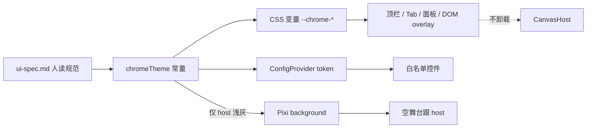
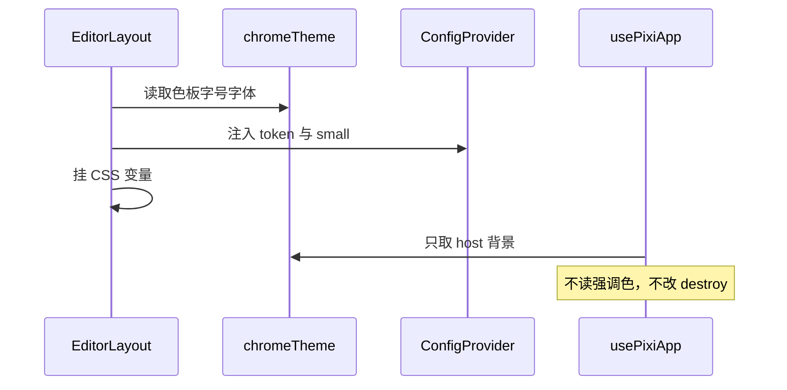

## 背景

人读规范已在 `docs/product/ui-spec.md`。现状：`chromeTheme` 只有四色；`ConfigProvider` 只设了 `colorPrimary`；按钮多为 `small`，改尺寸 `Input` 仍是默认高度；手风琴圆角 10、折叠用 `>` / `∨`；`src/style.less` 仍带 Vite 暗色根样式。`#pixi-host` 与 Pixi `background` 已跟 `#ebebeb`。本变更落在 UI 壳与 model token，不改文档模型。动机见 `proposal.md`。

## 目标 / 非目标

**目标：**

- token 模块成为壳层视觉唯一真源，同时导出 CSS 变量和 Ant `theme.token`
- 编辑器根 `componentSize: small` + 中文友好 `fontFamily`；漏网控件收口
- 去掉与浅色壳冲突的全局暗色残留
- 现有壳读 token；手风琴圆角 8、折叠改 IconPark outline

**非目标：**

- 不把规范全文写进主 spec；不换皮、不做暗色、不改四区像素
- 不迁裁剪 overlay、不画 feat-008 手柄、不二次封装 Ant
- 不把肤色或规范版本写入 Pinia 文档

## 数据流与分层

本变更落在 **model 纯函数（token）** 和 **UI 壳层**。邻居：Layout 读 token 喂 `ConfigProvider` 与 CSS 变量；Pixi init **只读 host 浅灰**；Pinia / scene **不改**。

| 层 | 本变更做什么 | 公开契约 |
|---|---|---|
| model | 扩展色 / 字号 / 间距 / 圆角 / 字体 / Ant 映射 | 现有 `CHROME_*` 加导出函数或常量；`chromeTheme.spec.ts` |
| UI | `ConfigProvider`、去裸 hex、手风琴图标、清 `style.less` | 仍只 `emit` / store action；不 import pixi |
| core | 无新生命周期；background 继续跟 host token | `createPixiAppInitOptions` |
| Pinia / scene | 不改 | — |

## 决策

### 决策 1：chromeTheme 双轨映射，不当成文档真源

- **结论：** 视觉常量留在 model，经 CSS 变量和 `ConfigProvider` 消费；不写入 Pinia。
- **理由：** 肤色不是图层；proposal 禁止第二业务真源。Pixi 只允许读 host 色，避免强调色污染空舞台。
- **弃用方案：** 以 Ant token 为真源（管不住 Tab/overlay）；或只写 CSS 变量（Button/Input 会漂）。

### 决策 2：根上 small，对话框保持库默认

- **结论：** 编辑器 `ConfigProvider` 设 `componentSize: small`；`Modal` / `message` 不强制 compact。
- **理由：** 左面板 220px 需要 24px 控件；对话框被压成 small 会难点。
- **弃用方案：** 每个按钮手写 `size`（已漏网）；或两套密度随场景切换。

### 决策 3：第一刀收口壳层，不重做 CropOverlay 像素

- **结论：** 去裸 hex、small、圆角 8、IconPark 箭头、清暗色 CSS。裁剪手柄 10px 留待后续按 ui-spec 收敛。
- **理由：** 规范可执行与「全面换皮」必须拆开，避免和调整 Tab 行为搅在一起。
- **弃用方案：** 同一 change 把 CropOverlay 和全部面板重做成 100% 合规。

### 决策 4：字体跟 Ant 栈并点名中文系统黑体

- **结论：** `fontFamily` 在系统 UI 之后插入 `"PingFang SC", "Microsoft YaHei"`，不下载 Web 字体。
- **理由：** 去掉 Vite 的 Avenir 优先栈；Windows 中文 11/12px 才稳定。
- **弃用方案：** 引入思源/普惠字体文件。

## 风险与权衡

- [清 `style.less` 波及非编辑器页] → 本仓库根路由即 `/editor`，全局浅色与壳一致；保留 html/body 满高，只删暗色字色与默认 button 皮肤。
- [Ant token 名与 CSS 变量漂移] → 映射函数单测：主色、host、字号 12、圆角 6。
- [IconPark 折叠图标换行] → 与 Tab 相同 `outline` + `currentColor` + 14px。
- [强调色与错误色接近] → 错误固定 Ant `#ff4d4f`，禁止改成强调粉。

## 验证策略

- **TDD：** token 常量（含 host `#ebebeb`、强调 `#ff4d6d`、间距阶 4/8/12/16、字号 11/12/13/14、字体含 PingFang SC）；Ant 映射含 `colorPrimary` 与 `fontSize` 12。先红后绿。
- **手工：** 浅色壳；系统暗色偏好下仍浅底深字；顶栏与改尺寸输入同为 compact；手风琴无 `>` / `∨`；切 Tab 不重挂 canvas。
- **禁止：** 为 Pixi 帧写 unit spec。

## 迁移与回滚

无运行时迁移。回滚即还原 `chromeTheme`、`EditorLayout`、`style.less` 与手风琴。人读 `ui-spec.md` 可保留。

## 未决问题

无。
