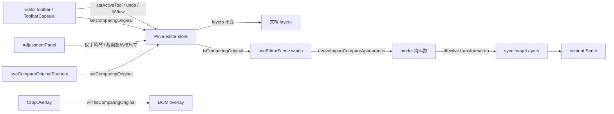
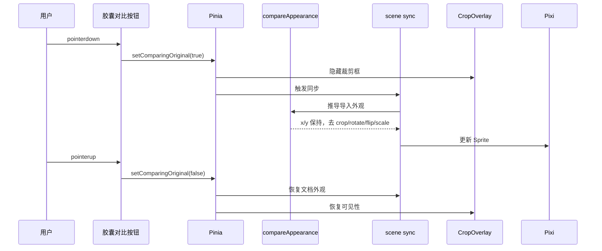

## 背景

顶栏 `EditorToolbar.vue` 为文字三分区；平移在 `AdjustmentPanel.vue` 通过 `setActiveTool('pan')` 切换。Pinia 已有 `activeTool`、`spacePan`、`commandStack`；scene 经 `syncImageLayers` 单向读文档图层。裁剪 overlay 为 DOM，由 `CropOverlay.vue` 绘制。人读 PRD 与 ui-spec §10.1 已定稿。动机见 `proposal.md`。

## 目标 / 非目标

**目标：**

- 顶栏左/胶囊/右布局；IconPark + Tooltip；去掉历史占位
- 平移入口迁至胶囊「抓手」；调整面板去平移按钮
- 壳层 `isComparingOriginal` + model 纯函数推导对比外观；scene 同步时读 flag，不改文档
- `\` 快捷键；对比时隐藏 `CropOverlay`
- 再次导入清 `commandStack` 与对比态

**非目标：**

- 不实现导出、历史面板、H/Ctrl+0
- 不新增第二图层存原图；不把对比写入 undo
- 不改 viewport-navigation 手势契约

## 数据流与分层

| 层 | 职责 | 公开契约 |
|---|---|---|
| UI | 顶栏胶囊、Tooltip、对比按住、去调整面板平移 | store action；不 import pixi |
| model | `deriveImportCompareAppearance(layer): { transform, crop? }` | TDD `*.spec.ts` |
| Pinia | `isComparingOriginal`；导入时 `commandStack.clear()` | `setComparingOriginal` |
| scene | sync 读 flag，对 Sprite 应用 effective 外观 | 仍不改 store 私有字段 |
| tools | `\` keydown/keyup；Input 聚焦 guard | 复用 `useViewportGestures` 模式 |

**对比外观推导（不变量）：**

- 世界锚点：`layer.transform.x/y`（当前可见图中心）
- `rotation = 0`，`flipX/flipY = false`
- `scaleX = scaleY = 1`（自然像素，忽略改尺寸）
- 无 crop mask；anchor 0.5 对整张 natural 纹理

## 决策

### 决策 1：对比态放壳层 store，不进文档

- **结论：** `isComparingOriginal` 为 Pinia 壳层字段；`layers[]` 不变。
- **理由：** 对比是视图预览，不是编辑命令；避免污染 undo 与导出。
- **弃用方案：** 临时克隆 layer 写入文档（需 undo 特殊 case）；或在 Pixi 上叠第二张 Sprite（难与 sync  id 一致）。

### 决策 2：scene sync 读 flag 而非改 layer 副本

- **结论：** `syncImageLayers` 或 `applyImageLayer` 入参增加 optional effective appearance；由 `useEditorScene` 根据 flag 传入推导结果。
- **理由：** 保持单向 sync；文档仍是唯一业务真源。
- **弃用方案：** 在 sync 内直接读 store（scene 层耦合 store 类型，可接受但需避免 UI import pixi 反向）。

### 决策 3：对比按钮用按住，不用 click toggle

- **结论：** `pointerdown` 开、`pointerup`/leave 关；与 PRD 一致。
- **理由：** 避免忘记关对比；与 `\` 按住语义一致。
- **弃用方案：** click 锁定（Non-goal）。

### 决策 4：顶栏拆 `ToolbarCapsule.vue`

- **结论：** 胶囊内分组与竖线独立组件；`EditorToolbar` 只负责三列 grid 与 file input。
- **理由：** 单文件有效逻辑约 200 行；分组样式可测 data-testid。
- **弃用方案：** 全部堆在 `EditorToolbar.vue`。

### 决策 5：换图清 commandStack 在 `addImageLayer`

- **结论：** 替换主图时 `commandStack.clear()`、`isComparingOriginal = false`、关闭裁剪/旋转/改尺寸草稿（若 store 有 session 字段一并 reset）。
- **理由：** PRD 明确要求；避免 undo 指向旧图状态。
- **弃用方案：** 保留栈（现网缺口，本 change 修复）。

## 风险与权衡

- [裁剪中抓手与框抢手势] → 沿用 viewport-navigation 与 crop tools 现有互斥；PRD 验收 T6
- [pointerup 在窗口外丢失] → `window` 级 pointerup/mouseup 监听释放对比
- [对比时顶栏误触] → 按住对比期间 capsule 其它按钮 pointer-events 或 guard
- [derive 与 visibleImageAnchor 不一致] → TDD 覆盖 crop+rotate+resize 组合

## 验证策略

| 区域 | 方式 |
|---|---|
| `deriveImportCompareAppearance` | vitest 先红后绿 |
| 换图清栈 | `editor.spec.ts` 或 command stack spec |
| 顶栏布局 / 图标 / Tooltip | 手工 `/editor` |
| 按住对比 / `\` / overlay 隐藏 | 手工 |
| 抓手 / 空格 / 中键 | 回归 feat-007 清单 |
| `./init.sh` | lint + test + build + openspec validate |

不为 Pixi WebGL 帧写 unit spec。

## 迁移与回滚

无运行时迁移。落地顺序：model 纯函数 → store flag → scene sync → UI 顶栏 → 去调整面板平移 → 快捷键 → 换图清栈。回滚：还原 `EditorToolbar` / `AdjustmentPanel` / store 字段 / sync 分支即可；无持久化格式变更。

## 未决问题

无。
