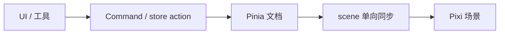

## 背景

<!-- 只写影响实现的现状与约束。动机见 proposal.md，不要复述 Why。 -->

## 目标 / 非目标

**目标：**

<!-- 本设计要落地的技术结果 -->

**非目标：**

<!-- 明确不做、留给后续 feat 的部分 -->

## 数据流与分层

<!-- 必须至少一张 mermaid 图。节点用中文标职责，边用中文标动作。 -->

<!-- 点名：本变更落在哪一层；邻居用哪份公开契约（类型 / action / emit）。 -->

## 决策

<!-- 每条：结论、理由、弃用的替代方案。 -->

### 决策 1：<!-- 标题 -->

- **结论：**
- **理由：**
- **弃用方案：**

## 风险与权衡

<!-- 格式：[风险] → 缓解 -->

- [风险] → 缓解

## 验证策略

<!-- 纯逻辑：先红后绿的 spec。画布 / GPU：手工清单。 -->

## 迁移与回滚

<!-- 落地步骤与回滚方式。无运行时迁移可写「无运行时迁移」。 -->

## 未决问题

<!-- 可延后且不影响 spec / 任务拆分。没有则写「无」。 -->
